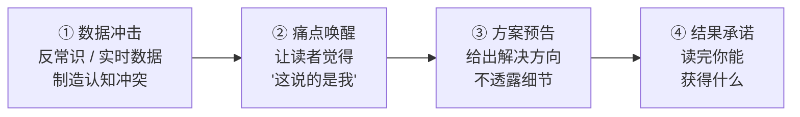

# 高质量高吸引力博客写作指南

## 一、写作前四问

动笔前必须回答四个问题：

| 问题 | 说明 |
|---|---|
| **读者是谁？** | 明确目标人群画像（技术栈、经验水平、职位） |
| **痛点是什么？** | 读者当前正在经历什么具体问题？ |
| **读完获得什么？** | 承诺一个可量化的结果（如"30 分钟部署"、"月赚 ¥500"） |
| **凭什么是你写？** | 差异化：经验、数据、踩坑记录、对比视角 |

如果四个问题答不上来，说明选题没想清楚。

---

## 二、标题工程

标题决定 80% 的点击率。必须遵守以下规则：

### 2.1 前 20 字规则

标题前 20 个字必须包含**情绪关键词**。没有情绪关键词的文章阅读量大概率惨淡。

| 情绪关键词库 | | | |
|---|---|---|---|
| 闲置 | 吃灰 | 赚钱 | 被动收入 |
| 崩溃 | 错误 | 陷阱 | 优化 |
| 提升 | 避坑 | 月入 | 实现 |

### 2.2 标题结构公式

| 公式 | 示例 |
|---|---|
| **数字 + 利益** | 「闲置一张 RTX 4090，每月多赚 ¥500+」 |
| **痛点 + 反差** | 「你的 GPU 在吃灰，别人的在赚钱」 |
| **问题 + 答案** | 「内网 GPU 连不上 vast.ai？一台 VPS 就能解决」 |
| **反常识** | 「为什么有公网 IP 的机器反而连不上？」 |

### 2.3 反面教材

- ❌ 以「如何/怎么/指南」开头（降低点击欲望）
- ❌ 无数字、无情绪、无利益（如「关于 XX 的一些思考」）
- ❌ 标题超过 30 字（在搜索结果中被截断）

---

## 三、开头四步法

开头 3 秒决定读者是否继续。每一段有一个明确目的：



### 3.1 数据冲击

用反常识事实或实时数据开场。来源必须可查证。

> ✅ 好：「2026 年 5 月，Blackwell GPU 租赁价格两个月涨了 48%，H100 合约价半年涨了 40%。」

> ❌ 坏：「随着 AI 技术的快速发展，算力需求日益增长...」

### 3.2 痛点唤醒

直接描述读者正在经历的具体场景。

> ✅ 好：「你的 RTX 4090 每天跑 4-6 小时训练，剩下 18 小时在空转。电费照付，折旧照算。」

### 3.3 方案预告 + 结果承诺

一句话说明方案 + 一句话承诺结果。

> ✅ 好：「本文提供一套已验证的方案：一台 ¥30/月的中继 VPS + 两条命令，30 分钟部署，开始赚钱。」

---

## 四、可跳读的信息架构

每一节服务一组读者，允许从目录直接跳到感兴趣的部分：

| 读者类型 | 关注的内容 |
|---|---|
| 决策者 | 对比表、经济账、预期收益 |
| 技术实操者 | 原理、部署步骤、配置模板 |
| 遇坑者 | FAQ、排查命令 |
| 进阶读者 | 架构设计、技术选型理由、局限性 |

### 4.1 问题式小标题

**问题式小标题** > 总结式小标题（利于 AI 搜索召回和读者扫读）：

| ❌ 总结式 | ✅ 问题式 |
|---|---|
| FRP 端口隧道原理 | 内网没公网 IP，FRP 怎么把端口暴露出去？ |
| 幂等设计哲学 | 脚本跑错了会破坏系统吗？ |
| 整体架构 | 为什么你的 GPU 连不上 vast.ai？ |

### 4.2 每节末尾加"一句话结论"

每节结束时，用加粗写一句可以独立引用的话，方便读者摘录和分享。

> **一句话**：FRP + TUN 透明代理配合，解决了内网机器"出不去也进不来"的双向网络问题。

### 4.3 段落控制

- 段落 2-5 行，超过 8 行必拆分
- 连续不超过 3 段纯文字，中间穿插表格 / 代码 / 图表 / 符号

---

## 五、信息密度

用结构化元素代替大段文字说明：

| 手段 | 替代 | 效果 |
|---|---|---|
| 对比表格 | 大段优劣描述 | 一目了然，节省 70% 篇幅 |
| Mermaid 流程图 | 文字架构说明 | 视觉记忆强 6 倍 |
| 配置示例 + 标注 | 空谈原理 | 可直接复制使用 |
| 一句话原理 | 三页原理说明 | 降低理解门槛 |

### 5.1 一句话原理

在解释每个技术组件时，先用一句话说清本质：

> **一句话原理**：Shadowsocks 将数据用 AEAD 算法加密后发送，外形和随机数据无异，不会被 DPI 识别为代理流量。

### 5.2 配置块标注

在配置示例中用注释标注关键行：

```yaml
tun:
  enable: true              # 启用 TUN 模式，接管所有流量
  stack: gvisor             # 用户态 TCP/IP 栈，不受防火墙影响
  dns-hijack:
    - any:53                # 劫持 DNS 防污染
```

---

## 六、情绪节奏

读者注意力是稀缺资源，需要主动制造"钩子"来维持。

### 6.1 钩子分布

```
[数据冲击] → 市场规模 / 你损失了多少
[痛点共鸣] → 你的设备和处境
[认知反转] → 原来解决方案这么简单
[方案呈现] → 架构 + 原理
[实操引导] → 命令 + 配置
[预期管理] → 第一月 vs 稳定期
[行动召唤] → 从一张卡 / 一个项目开始
```

### 6.2 视觉节奏

- 关键句加粗——每段 1-2 处，引导视线
- 用符号做视觉断点——✅ ❌ ⚠️ → ✓ ✗
- 代码块放在两个文字段落之间，充当"视觉呼吸"

---

## 七、信任感

读者相信你，才会按你的方案行动。信任感来自具体而非抽象。

| 手段 | 示例 |
|---|---|
| **引用权威来源** | SemiAnalysis 报告、IDC 预测、中国信通院 —— 附链接 |
| **给出具体版本号** | FRP v0.68.1、Mihomo v1.19.25、Docker 28.0.4 |
| **坦陈局限性** | "中继带宽是瓶颈"、"首月收益是稳态的 30-40%" |
| **展示代码** | 贴 `safe_write_file` 源码片段，而不是说"脚本很健壮" |
| **利益声明** | 如果文中有推广链接，明确告知读者 |

---

## 八、经济算账

涉及收益 / 成本 / 回报的内容，必须用表格分场景展示，而非只给一个数字。因为读者的情况各不相同。

### 8.1 分场景计算表

| GPU 型号 | 总收入/月 | 电费 | 折旧 | 平台费 | **净利润** |
|---|---|---|---|---|---|
| RTX 4090 | ~¥1050 | ~¥190 | ~¥270 | ~¥210 | **~¥380** |
| RTX 5090 | ~¥1520 | ~¥220 | ~¥380 | ~¥304 | **~¥616** |

### 8.2 单一变量影响表

当某个关键变量（如电费）对结果影响大时，单独拉一张表展示不同取值下的结果：

| 电价 | ¥0.4 | ¥0.6 | ¥0.8 | ¥1.0 |
|---|---|---|---|---|
| 月净利 | ~¥530 | ~¥450 | ~¥380 | ~¥300 |

### 8.3 核心计算

涉及收益计算时，展示核心公式，让读者可以代入自己的数据：

```
月净利润 = (时薪 × 小时/天 × 30 × 利用率%) - 月电费 - 月折旧 - 平台费用
```

### 8.4 关键结论

用加粗列出从数据中提炼的结论，让不读全表的读者也能抓住要点：

> - **RTX 4090 是甜点卡**——费率够高、折旧可控
> - **电费超过 ¥1.0/kWh，利润大幅缩水**
> - **第一月收益是稳态的 30-40%**——别被首月数据劝退

---

## 九、身份共鸣

让读者觉得"这篇文章是写给我的"。

- 全文用**"你"**而非"用户"对话
- 开篇直接点出读者特征：

> 如果你有一张 RTX 4090，每天跑 4-6 小时训练...
> 如果你之前尝试过出租 GPU 但因为网络问题放弃...
> 如果你每个月电费超过 ¥0.6/kWh...

- 承认读者的处境，不居高临下：

> ✅ 「你可能也遇到过：SSH 连不上，不知道从哪查起。」
> ❌ 「很多人不懂怎么排查 SSH 问题。」

---

## 十、结尾设计

结尾不做总结，做**升番**。三种有效收尾方式：

| 方式 | 示例 |
|---|---|
| **金句** | 「你买的到底是显卡，还是一台印钞机？」 |
| **首尾呼应** | 回到开头场景，形成闭环 |
| **行动召唤** | 「从一张卡开始试水」 |

### 反面教材

- ❌ 「总之，本文介绍了...」——读者已经看完了
- ❌ 「随着技术的不断发展，XX 将会...」——陈词滥调
- ❌ 「如果觉得有用，请点赞收藏」——苍白

---

## 十一、分发适配

### 11.1 各平台内容形态

| 平台 | 内容形态 | 发布策略 |
|---|---|---|
| **知乎** | 完整版长文 + 图表 + 代码块 | 首发，SEO 权重最高 |
| **V2EX** | 精简版 + 讨论引导 | 发"分享创造"节点，附收益截图 |
| **即刻** | 金句卡片 + 数据分布图 | 分 3-5 条动态发，加话题标签 |
| **小红书** | 图文版（大字封面 + 配置模板截图） | 封面用数字大字 |
| **Twitter/X** | 技术线程（10 条推） | 每条一个要点，最后贴原文链接 |
| **公众号** | 完整版 + 打赏二维码 | 标题用收益前置或痛点反转 |

### 11.2 GEO 优化（AI 搜索）

2026 年 AI 搜索流量增长 858%，GEO 优化成为必备：

- **文章开头加摘要段**——AI 检索时第一段内容最可能被引用
- **问题式小标题**——匹配用户在 AI 搜索框中的自然语言 query
- **代码块加注释说明**——AI 能理解代码意图
- **截图中的关键信息同时以文字写出**——AI 无法读取图片

---

## 十二、七维自检评分

发布前用以下框架给文章打分，满分 10 分，**< 8 分不发布**：

| 维度 | 权重 | 自检问题 | 评分(1-10) |
|---|---|---|---|
| **情绪激活度(E)** | 20% | 读者读完后有情绪波动吗？（好奇/共鸣/冲动） | /10 |
| **表达流畅度(F)** | 20% | 读起来顺不顺？有没有记忆点和节奏感？ | /10 |
| **标题穿透力(H)** | 15% | 前 20 字有情绪关键词吗？有数字吗？ | /10 |
| **思想穿透力(T)** | 15% | 有没有触及根本性问题或给出独特视角？ | /10 |
| **身份共鸣度(I)** | 10% | 读者会觉得"这说的是我"吗？ | /10 |
| **认知冲击力(C)** | 10% | 有没有反直觉的数据或观点？ | /10 |
| **行动转化力(A)** | 10% | 读者知道读完下一步该做什么吗？ | /10 |

> **爆款指数 = H×0.15 + T×0.15 + E×0.20 + F×0.20 + C×0.10 + I×0.10 + A×0.10**

### 快速检查清单

发布前逐项确认：

- [ ] 标题前 20 字有情绪关键词
- [ ] 开头 3 段有数据冲击或痛点唤醒
- [ ] 段落不超过 5 行
- [ ] 关键句已加粗
- [ ] 至少有一个对比表格或 Mermaid 图
- [ ] 有可复制的代码块或配置模板
- [ ] 坦陈了局限性
- [ ] 结尾不是"总结"，而是金句 / 反问 / 行动
- [ ] 七维自评 ≥ 8 分
- [ ] 已适配至少一个分发平台的内容形态
