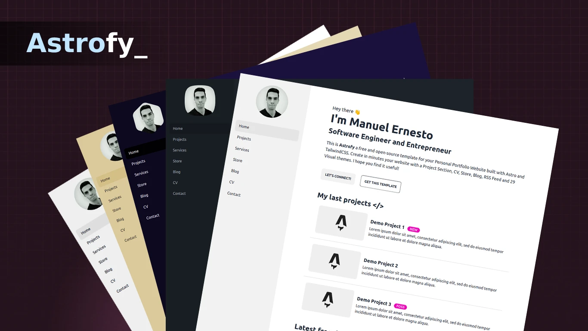

# Astrofy | 个人作品集网站模板



Astrofy 是一个使用 Astro 和 TailwindCSS 构建的免费开源个人作品集网站模板。它可以帮助您在几分钟内创建包含博客、简历、项目展示、商店和 RSS 订阅功能的网站。

## 在线演示

查看 [Astrofy](https://astrofy-template.netlify.app/) 的在线演示

## 安装

在终端中运行以下命令：

```bash
# 安装依赖
pnpm install
```

安装完成后，您就可以运行 Astro。Astro 内置了开发服务器，提供了开发所需的所有功能。使用 `astro dev` 命令启动本地开发服务器，这样您就可以看到新网站的实际运行效果。

```bash
# 启动开发服务器（默认端口：4321）
pnpm run dev
```

## 运行命令

### 开发环境命令

```bash
# 1. 安装依赖
pnpm install

# 2. 启动开发服务器（默认端口：4321）
pnpm dev

# 3. 在开发服务器中预览
pnpm preview

# 4. 检查项目配置
pnpm astro check
```

### 生产环境命令

```bash
# 1. 构建生产环境版本
pnpm build

# 2. 预览生产构建结果
pnpm preview

# 3. 部署到生产环境
pnpm deploy

# 4. 生成站点地图
pnpm astro sitemap

# 5. 生成RSS订阅
pnpm astro rss
```

### 其他实用命令

```bash
# 添加新集成
pnpm astro add

# 生成静态文件
pnpm astro build

# 清理缓存
pnpm astro clean

# 查看帮助信息
pnpm astro --help
```

## 项目结构

### 项目根目录结构
```
├── .astro/              # Astro配置文件
├── .github/            # GitHub工作流配置
├── .vscode/            # VSCode配置
├── public/             # 静态资源目录
├── src/                # 源代码目录
├── astro.config.mjs    # Astro配置文件
├── package.json        # 项目依赖配置
├── tailwind.config.cjs # TailwindCSS配置
├── tsconfig.json       # TypeScript配置
└── LICENSE             # 许可证文件
```

### 源代码目录结构
```
src/
├── components/         # 可复用的组件
├── config.ts          # 配置文件
├── content/           # 内容文件（博客、项目等）
├── env.d.ts          # 环境变量声明
├── layouts/          # 页面布局
├── lib/              # 工具库
├── pages/            # 页面文件
└── styles/           # 样式文件
```

## 技术栈

- **框架**: Astro 4.0.2
- **样式**: TailwindCSS 3.3.5 + DaisyUI 4.4.10
- **Markdown**: Astro MDX 2.0.3
- **图片处理**: Sharp 0.32.6
- **日期处理**: Dayjs 1.11.9
- **RSS生成**: Astro RSS 3.0.0
- **站点地图**: Astro Sitemap 3.0.1
- **代码高亮**: Astro Expressive Code 0.38.1

## 页面布局

项目使用了多个布局组件来组织页面结构：

1. **BaseLayout.astro** - 基础布局
   - 包含头部（Header）、侧边栏（SideBar）和底部（Footer）
   - 支持响应式设计
   - 集成了SEO优化
   - 支持主题切换
   - 包含过渡动画效果

2. **CVLayout.astro** - 简历页面布局
   - 用于简历页面的特殊布局
   - 支持中英文版本

3. **PostLayout.astro** - 博客文章布局
   - 优化的博客文章阅读体验
   - 支持文章元数据

4. **StoreItemLayout.astro** - 商品展示布局
   - 用于商店页面的商品展示
   - 响应式商品卡片设计

## 项目特点

1. 响应式设计
2. SEO优化
3. RSS订阅支持
4. 站点地图自动生成
5. Markdown支持
6. TypeScript支持
7. 自定义主题配置
8. 可配置的导航菜单
9. 项目/博客分类
10. 联系表单集成

## 开发环境要求

- Node.js 18.0.0 或更高版本
- pnpm 7.0.0 或更高版本

## 许可证

本项目采用MIT许可证。详情请参阅[LICENSE](./LICENSE)文件。
