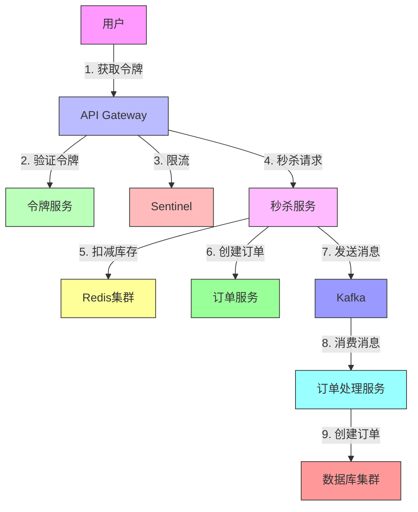

## 引言

在当今互联网应用中，高并发处理能力已成为衡量系统设计优劣的关键指标。随着用户规模的增长和业务复杂度的提升，如何设计出能够支撑高并发的系统架构成为每个架构师必须面对的挑战。

本文系统性地介绍高并发架构设计的核心原则、常见模式及实践技巧，结合具体案例和代码示例，帮助开发者构建高性能、高可用的分布式系统。无论您是正在设计新系统，还是优化现有系统，本文都能为您提供有价值的参考。

## 一、核心设计理念

### 1. 无状态服务设计

- **概念解析**：服务不保存客户端状态，每个请求都是独立的
- **优势**：
  - 实现服务的水平扩展：可以轻松增加或减少服务实例
  - 提高系统的可维护性：服务实例之间完全对等
  - 简化故障恢复：请求可以路由到任意可用实例
  - 提高系统整体可用性：单点故障不会影响整体服务
- **实践建议**：
  - 将会话状态外部化（如Redis、Memcached）
  - 使用JWT等无状态认证机制
  - 避免在本地内存中保存业务状态
  - 使用统一的配置中心管理服务配置

```java
// 示例：使用Spring Session + Redis实现分布式会话
@Configuration
@EnableRedisHttpSession(maxInactiveIntervalInSeconds = 1800) // 30分钟会话过期
public class HttpSessionConfig {
    
    @Value("${spring.redis.host:localhost}")
    private String redisHost;
    
    @Value("${spring.redis.port:6379}")
    private int redisPort;
    
    @Value("${spring.redis.password:}")
    private String redisPassword;
    
    @Value("${spring.redis.database:0}")
    private int database;
    
    @Bean
    public RedisConnectionFactory connectionFactory() {
        RedisStandaloneConfiguration config = new RedisStandaloneConfiguration();
        config.setHostName(redisHost);
        config.setPort(redisPort);
        if (StringUtils.hasText(redisPassword)) {
            config.setPassword(redisPassword);
        }
        config.setDatabase(database);
        
        // 使用Lettuce客户端
        LettuceClientConfiguration clientConfig = LettuceClientConfiguration.builder()
            .commandTimeout(Duration.ofSeconds(2))
            .shutdownTimeout(Duration.ZERO)
            .build();
            
        return new LettuceConnectionFactory(config, clientConfig);
    }
    
    @Bean
    public RedisTemplate<String, Object> redisTemplate() {
        RedisTemplate<String, Object> template = new RedisTemplate<>();
        template.setConnectionFactory(connectionFactory());
        
        // 使用StringRedisSerializer来序列化和反序列化redis的key值
        template.setKeySerializer(new StringRedisSerializer());
        template.setHashKeySerializer(new StringRedisSerializer());
        
        // 使用GenericJackson2JsonRedisSerializer来序列化和反序列化redis的value值
        template.setValueSerializer(new GenericJackson2JsonRedisSerializer());
        template.setHashValueSerializer(new GenericJackson2JsonRedisSerializer());
        
        template.afterPropertiesSet();
        return template;
    }
}
```

### 配置示例 (application.yml)

```yaml
spring:
  redis:
    host: ${REDIS_HOST:localhost}
    port: ${REDIS_PORT:6379}
    password: ${REDIS_PASSWORD:}
    database: 0
    timeout: 2000ms
    lettuce:
      pool:
        max-active: 8
        max-wait: -1ms
        max-idle: 8
        min-idle: 0
```

### 2. 冗余与副本机制

- **多副本部署**：
  - 主从复制：一主多从架构
  - 多主复制：多主节点同时提供服务
  - 一致性哈希：解决数据分布问题
- **读写分离**：
  - 写主库，读从库
  - 读写分离中间件（如MyCat、ShardingSphere）
  - 主从延迟问题解决方案
- **数据分片**：
  - 水平分片：按行分片
  - 垂直分片：按列分片
  - 分片策略：范围分片、哈希分片、时间分片

```sql
-- 示例：MySQL分表设计
CREATE TABLE `order_2023` (
    `id` bigint(20) NOT NULL AUTO_INCREMENT,
    `order_no` varchar(32) NOT NULL,
    `user_id` bigint(20) NOT NULL,
    `amount` decimal(10,2) NOT NULL,
    `create_time` datetime NOT NULL,
    PRIMARY KEY (`id`),
    KEY `idx_user_id` (`user_id`),
    UNIQUE KEY `uk_order_no` (`order_no`)
) ENGINE=InnoDB DEFAULT CHARSET=utf8mb4;
```

### 3. 异步化处理

- **消息队列应用场景**：
  - 削峰填谷：平滑处理突发流量
  - 应用解耦：降低系统间耦合度
  - 流量控制：控制处理速度，保护下游系统
  - 最终一致性：实现分布式事务
  - 事件驱动：构建响应式系统

- **主流消息中间件比较**：

  | 特性 | Kafka | RabbitMQ | RocketMQ |
  |------|-------|----------|----------|
  | 吞吐量 | 极高 | 高 | 高 |
  | 延迟 | 毫秒级 | 微秒级 | 毫秒级 |
  | 可靠性 | 高 | 高 | 高 |
  | 事务 | 支持 | 支持 | 支持 |
  | 适用场景 | 日志、流处理 | 企业级应用 | 金融级应用 |

- **代码示例：Spring Boot + Kafka实现消息生产消费**

```java
// 生产者配置
@Configuration
@EnableKafka
public class KafkaProducerConfig {
    
    @Value("${spring.kafka.bootstrap-servers}")
    private String bootstrapServers;
    
    @Value("${spring.kafka.producer.retries:3}")
    private int retries;
    
    @Value("${spring.kafka.producer.ack:all}")
    private String acks;
    
    @Value("${spring.kafka.producer.batch-size:16384}")
    private int batchSize;
    
    @Value("${spring.kafka.producer.buffer-memory:33554432}")
    private long bufferMemory;
    
    @Value("${spring.kafka.producer.linger-ms:100}")
    private long lingerMs;
    
    @Value("${spring.kafka.producer.compression-type:gzip}")
    private String compressionType;
    
    @Bean
    public ProducerFactory<String, String> producerFactory() {
        Map<String, Object> configProps = new HashMap<>();
        // 基础配置
        configProps.put(ProducerConfig.BOOTSTRAP_SERVERS_CONFIG, bootstrapServers);
        configProps.put(ProducerConfig.KEY_SERIALIZER_CLASS_CONFIG, StringSerializer.class);
        configProps.put(ProducerConfig.VALUE_SERIALIZER_CLASS_CONFIG, StringSerializer.class);
        
        // 可靠性配置
        configProps.put(ProducerConfig.ACKS_CONFIG, acks);
        configProps.put(ProducerConfig.RETRIES_CONFIG, retries);
        configProps.put(ProducerConfig.ENABLE_IDEMPOTENCE_CONFIG, true);
        
        // 性能调优
        configProps.put(ProducerConfig.BATCH_SIZE_CONFIG, batchSize);
        configProps.put(ProducerConfig.BUFFER_MEMORY_CONFIG, bufferMemory);
        configProps.put(ProducerConfig.LINGER_MS_CONFIG, lingerMs);
        configProps.put(ProducerConfig.COMPRESSION_TYPE_CONFIG, compressionType);
        
        // 安全配置（如果需要）
        if (bootstrapServers.contains("SASL")) {
            configProps.put("security.protocol", "SASL_SSL");
            configProps.put("sasl.mechanism", "PLAIN");
        }
        
        return new DefaultKafkaProducerFactory<>(configProps);
    }
    
    @Bean
    public KafkaTemplate<String, String> kafkaTemplate() {
        KafkaTemplate<String, String> template = new KafkaTemplate<>(producerFactory());
        
        // 设置默认主题（可选）
        template.setDefaultTopic("default-topic");
        
        // 设置生产者监听器
        template.setProducerListener(new ProducerListener<String, String>() {
            private final Logger log = LoggerFactory.getLogger(ProducerListener.class);
            
            @Override
            public void onSuccess(ProducerRecord<String, String> record, RecordMetadata metadata) {
                log.info("Message sent successfully - Topic: {}, Partition: {}, Offset: {}, Value: {}", 
                        metadata.topic(), 
                        metadata.partition(), 
                        metadata.offset(),
                        record.value());
            }

            @Override
            public void onError(ProducerRecord<String, String> record, Exception exception) {
                log.error("Failed to send message - Topic: {}, Key: {}, Value: {}", 
                        record.topic(),
                        record.key(),
                        record.value(), 
                        exception);
                // 这里可以添加重试或告警逻辑
            }
        });
        
        // 设置事务ID前缀（如果启用事务）
        template.setTransactionIdPrefix("tx-");
        
        return template;
    }
    
    // 批量消息支持
    @Bean
    public BatchMessagingTemplate batchMessagingTemplate() {
        return new BatchMessagingTemplate(kafkaTemplate());
    }
```

### 生产者使用示例

```java
@Service
@Slf4j
@RequiredArgsConstructor
public class OrderService {
    
    @Value("${kafka.topic.order:orders}")
    private String orderTopic;
    
    private final KafkaTemplate<String, String> kafkaTemplate;
    private final ObjectMapper objectMapper = new ObjectMapper();
    
    public void createOrder(Order order) {
        try {
            // 发送消息
            ListenableFuture<SendResult<String, String>> future = kafkaTemplate.send(
                orderTopic, 
                order.getOrderId(), 
                objectMapper.writeValueAsString(order)
            );
            
            // 异步回调
            future.addCallback(
                result -> log.info("Order created: {}", order.getOrderId()),
                ex -> log.error("Failed to create order: {}", order.getOrderId(), ex)
            );
            
        } catch (JsonProcessingException e) {
            log.error("Failed to serialize order: {}", order.getOrderId(), e);
            throw new RuntimeException("Failed to create order", e);
        }
    }
    
    // 批量发送消息
    public void batchCreateOrders(List<Order> orders) {
        List<CompletableFuture<SendResult<String, String>>> futures = orders.stream()
            .map(order -> {
                try {
                    return kafkaTemplate.send(
                        orderTopic,
                        order.getOrderId(),
                        objectMapper.writeValueAsString(order)
                    ).completable()
                     .whenComplete((result, ex) -> {
                         if (ex != null) {
                             log.error("Failed to send order: {}", order.getOrderId(), ex);
                         } else {
                             log.info("Order sent: {}", order.getOrderId());
                         }
                     });
                } catch (JsonProcessingException e) {
                    log.error("Failed to serialize order: {}", order.getOrderId(), e);
                    return CompletableFuture.<SendResult<String, String>>failedFuture(e);
                }
            })
            .collect(Collectors.toList());
            
        // 等待所有消息发送完成
        CompletableFuture.allOf(futures.toArray(new CompletableFuture[0])).join();
    }
    }
}
```


```yaml
spring:
  kafka:
    bootstrap-servers: ${KAFKA_BOOTSTRAP_SERVERS:localhost:9092}
    producer:
      retries: 3
      acks: all
      batch-size: 16384
      buffer-memory: 33554432
      linger-ms: 100
      compression-type: gzip
      properties:
        max.request.size: 1048576
        request.timeout.ms: 30000
        delivery.timeout.ms: 120000
        max.block.ms: 60000
    consumer:
      group-id: ${spring.application.name:myapp}-group
      auto-offset-reset: latest
      enable-auto-commit: false
      max-poll-records: 500
      fetch-max-wait: 500
      fetch-min-size: 1
      heartbeat-interval: 3000
      session-timeout: 10000
      max-poll-interval: 300000
      properties:
        max.partition.fetch.bytes: 1048576
        request.timeout.ms: 30000
        session.timeout.ms: 10000
        max.poll.records: 500
```

### 消费者配置

```java
@Slf4j
@Component
public class OrderConsumer {
    
    @Value("${kafka.topic.order:orders}")
    private String orderTopic;
    private final ObjectMapper objectMapper;
    private final OrderService orderService;
    
    public OrderConsumer(ObjectMapper objectMapper, OrderService orderService) {
        this.objectMapper = objectMapper;
        this.orderService = orderService;
    }
    
    @KafkaListener(
        topics = "${kafka.topic.order:orders}",
        groupId = "${spring.kafka.consumer.group-id:order-service-group}",
        containerFactory = "kafkaListenerContainerFactory"
    )
    public void consume(ConsumerRecord<String, String> record, Acknowledgment ack) {
        try {
            // 反序列化消息
            Order order = objectMapper.readValue(record.value(), Order.class);
            log.info("Processing order: {}", order.getOrderId());
            
            // 业务处理
            orderService.processOrder(order);
            
            // 手动提交偏移量
            ack.acknowledge();
            log.info("Successfully processed order: {}", order.getOrderId());
            
        } catch (Exception e) {
            log.error("Error processing order: {}", record.value(), e);
            // 可以根据异常类型决定是否重试
            if (shouldRetry(e)) {
                throw new RuntimeException("Retryable error processing order", e);
            }
        }
    }
    
    private boolean shouldRetry(Exception e) {
        // 实现重试逻辑
        return e instanceof NetworkException || e instanceof TimeoutException;
    }
    
    // 批量消费示例
    @KafkaListener(
        topics = "${kafka.topic.batch-orders:batch-orders}",
        containerFactory = "batchKafkaListenerContainerFactory"
    )
    public void batchConsume(List<ConsumerRecord<String, String>> records, Acknowledgment ack) {
        log.info("Received batch with {} records", records.size());
        
        try {
            List<Order> orders = records.stream()
                .map(record -> {
                    try {
                        return objectMapper.readValue(record.value(), Order.class);
                    } catch (JsonProcessingException e) {
                        log.error("Failed to deserialize order: {}", record.value(), e);
                        return null;
                    }
                })
                .filter(Objects::nonNull)
                .collect(Collectors.toList());
                
            // 批量处理订单
            orderService.batchProcessOrders(orders);
            
            // 手动提交偏移量
            ack.acknowledge();
            log.info("Successfully processed batch of {} orders", orders.size());
            
        } catch (Exception e) {
            log.error("Error processing batch of {} records", records.size(), e);
            throw new RuntimeException("Failed to process batch", e);
        }
    }
}

// 消费者配置类
@Configuration
@EnableKafka
public class KafkaConsumerConfig {
    
    @Value("${spring.kafka.bootstrap-servers}")
    private String bootstrapServers;
    
    @Value("${spring.kafka.consumer.group-id}")
    private String groupId;
    
    @Value("${spring.kafka.consumer.auto-offset-reset:latest}")
    private String autoOffsetReset;
    
    @Value("${spring.kafka.consumer.enable-auto-commit:false}")
    private boolean enableAutoCommit;
    
    @Value("${spring.kafka.consumer.max-poll-records:500}")
    private int maxPollRecords;
    
    @Value("${spring.kafka.consumer.concurrency:3}")
    private int concurrency;
    
    @Bean
    public ConsumerFactory<String, String> consumerFactory() {
        Map<String, Object> props = new HashMap<>();
        props.put(ConsumerConfig.BOOTSTRAP_SERVERS_CONFIG, bootstrapServers);
        props.put(ConsumerConfig.GROUP_ID_CONFIG, groupId);
        props.put(ConsumerConfig.AUTO_OFFSET_RESET_CONFIG, autoOffsetReset);
        props.put(ConsumerConfig.ENABLE_AUTO_COMMIT_CONFIG, enableAutoCommit);
        props.put(ConsumerConfig.KEY_DESERIALIZER_CLASS_CONFIG, StringDeserializer.class);
        props.put(ConsumerConfig.VALUE_DESERIALIZER_CLASS_CONFIG, StringDeserializer.class);
        props.put(ConsumerConfig.MAX_POLL_RECORDS_CONFIG, maxPollRecords);
        
        // 安全配置（如果需要）
        if (bootstrapServers.contains("SASL")) {
            props.put("security.protocol", "SASL_SSL");
            props.put("sasl.mechanism", "PLAIN");
        }
        
        return new DefaultKafkaConsumerFactory<>(props);
    }
    
    @Bean
    public ConcurrentKafkaListenerContainerFactory<String, String> kafkaListenerContainerFactory() {
        ConcurrentKafkaListenerContainerFactory<String, String> factory = new ConcurrentKafkaListenerContainerFactory<>();
        factory.setConsumerFactory(consumerFactory());
        
        // 设置并发消费者数量
        factory.setConcurrency(concurrency);
        
        // 设置手动提交
        factory.getContainerProperties().setAckMode(ContainerProperties.AckMode.MANUAL_IMMEDIATE);
        
        // 设置批量消费
        factory.setBatchListener(false);
        
        // 设置异常处理器
        factory.setErrorHandler(new SeekToCurrentErrorHandler(
            new FixedBackOff(1000L, 3) // 重试3次，每次间隔1秒
        ));
        
        return factory;
    }
    
    @Bean
    public ConcurrentKafkaListenerContainerFactory<String, String> batchKafkaListenerContainerFactory() {
        ConcurrentKafkaListenerContainerFactory<String, String> factory = new ConcurrentKafkaListenerContainerFactory<>();
        factory.setConsumerFactory(consumerFactory());
        
        // 启用批量消费
        factory.setBatchListener(true);
        
        // 设置并发消费者数量
        factory.setConcurrency(concurrency);
        
        // 设置手动提交
        factory.getContainerProperties().setAckMode(ContainerProperties.AckMode.MANUAL_IMMEDIATE);
        
        // 设置批量消费属性
        factory.getContainerProperties().setIdleEventInterval(60000L);
        factory.getContainerProperties().setPollTimeout(3000);
        
        return factory;
    }
    
    // 死信队列配置
    @Bean
    public DeadLetterPublishingRecoverer deadLetterPublishingRecoverer(KafkaTemplate<?, ?> template) {
        return new DeadLetterPublishingRecoverer(template, 
            (record, ex) -> new TopicPartition(record.topic() + ".DLT", record.partition()));
    }
    
    @Bean
    public SeekToCurrentErrorHandler errorHandler(DeadLetterPublishingRecoverer recoverer) {
        return new SeekToCurrentErrorHandler(recoverer, new FixedBackOff(1000L, 3));
    }
}
```

## 二、弹性设计模式

### 1. 服务熔断（Circuit Breaker）

熔断器是防止分布式系统雪崩的重要组件，通过快速失败和快速恢复机制保护系统。

#### 1.1 熔断器三态
- **关闭(Closed)**：请求正常处理，当失败率达到阈值时转为开启状态
- **开启(Open)**：快速失败，不执行实际调用，直接返回降级结果
- **半开(Half-Open)**：尝试恢复，允许部分请求通过进行探测

#### 1.2 Resilience4j 实现示例

##### Maven 依赖
```xml
<dependency>
    <groupId>io.github.resilience4j</groupId>
    <artifactId>resilience4j-spring-boot2</artifactId>
    <version>1.7.1</version>
</dependency>
<dependency>
    <groupId>org.springframework.boot</groupId>
    <artifactId>spring-boot-starter-aop</artifactId>
</dependency>
```

##### 熔断器配置 (application.yml)

```yaml
resilience4j:
  circuitbreaker:
    configs:
      default:  # 默认配置
        slidingWindowType: COUNT_BASED  # 滑动窗口类型: COUNT_BASED(基于调用次数)或TIME_BASED(基于时间)
        slidingWindowSize: 10           # 滑动窗口大小(次数或秒数)
        minimumNumberOfCalls: 5         # 计算失败率前的最小调用次数
        permittedNumberOfCallsInHalfOpenState: 3  # 半开状态下允许的调用次数
        automaticTransitionFromOpenToHalfOpenEnabled: true  # 自动从开启状态转为半开状态
        waitDurationInOpenState: 5s     # 开启状态转为半开状态的等待时间
        failureRateThreshold: 50         # 失败率阈值百分比，超过则触发熔断
        slowCallRateThreshold: 100       # 慢调用率阈值百分比
        slowCallDurationThreshold: 2s    # 慢调用时间阈值
        recordExceptions:                # 记录为失败的异常类型
          - org.springframework.web.client.HttpServerErrorException
          - java.io.IOException
          - java.util.concurrent.TimeoutException
          - org.springframework.web.client.ResourceAccessException
        ignoreExceptions:                # 忽略的异常类型(不计入失败统计)
          - com.example.BusinessException
    instances:
      paymentService:  # 支付服务专用配置
        baseConfig: default
        failureRateThreshold: 30  # 支付服务更敏感，使用更低的失败率阈值
      externalApiService:  # 外部API服务配置
        baseConfig: default
        slidingWindowSize: 20
        minimumNumberOfCalls: 10
        waitDurationInOpenState: 10s

# 健康检查端点配置
management:
  endpoint:
    health:
      show-details: always
      circuitbreakers:
        enabled: true
  endpoints:
    web:
      exposure:
        include: health,metrics,circuitbreakers
```

#### 配置说明：

1. **滑动窗口配置**
   - `slidingWindowType`: 推荐使用`COUNT_BASED`(基于调用次数)，更容易理解
   - `slidingWindowSize`: 根据系统QPS设置，建议值：QPS*2（最小为10）
   - `minimumNumberOfCalls`: 建议设置为`slidingWindowSize`的1/2

2. **熔断触发条件**
   - 当失败率 > `failureRateThreshold` 时触发熔断
   - 当慢调用率 > `slowCallRateThreshold` 时触发熔断
   - 慢调用定义：调用时间 > `slowCallDurationThreshold`

3. **状态转换**
   - 熔断器开启后，等待`waitDurationInOpenState`后转为半开状态
   - 半开状态下允许`permittedNumberOfCallsInHalfOpenState`次调用进行探测
   - 如果探测成功，则关闭熔断器；否则重新开启

4. **最佳实践**
   - 为不同服务设置不同的熔断配置
   - 监控熔断器状态变化，配置告警
   - 使用`@CircuitBreaker`注解时指定实例名称：`@CircuitBreaker(name = "paymentService")`
   - 结合`@TimeLimiter`使用，避免长时间阻塞

##### 服务层实现
```java
@Service
@RequiredArgsConstructor
public class PaymentService {
    
    private final RestTemplate restTemplate;
    private final CircuitBreakerRegistry circuitBreakerRegistry;
    
    @Value("${payment.service.url}")
    private String paymentServiceUrl;
    
    @CircuitBreaker(name = "paymentService", fallbackMethod = "processPaymentFallback")
    public PaymentResult processPayment(PaymentRequest request) {
        log.info("Processing payment: {}", request);
        return restTemplate.postForObject(
            paymentServiceUrl + "/api/payments", 
            request, 
            PaymentResult.class
        );
    }
    
    // 降级方法
    private PaymentResult processPaymentFallback(PaymentRequest request, Exception e) {
        log.warn("Payment service unavailable, using fallback", e);
        return PaymentResult.builder()
            .status("FALLBACK")
            .message("Payment service is temporarily unavailable")
            .build();
    }
    
    // 获取熔断器状态
    public CircuitBreaker.State getCircuitBreakerState() {
        return circuitBreakerRegistry.circuitBreaker("paymentService").getState();
    }
}
```

### 2. 服务降级（Fallback）

服务降级是在系统资源不足或服务不可用时，提供有损但可用的服务能力。

#### 2.1 降级策略
- **返回缓存数据**：从本地缓存或Redis获取旧数据
- **返回默认值**：返回业务可接受的默认值
- **返回空结果**：对于非核心功能，可返回空集合或null
- **降级服务**：提供简化版的服务逻辑

#### 2.2 Spring Cloud OpenFeign 降级实现

##### Feign 客户端定义
```java
@FeignClient(
    name = "user-service",
    url = "${feign.client.config.user-service.url}",
    fallback = UserServiceFallback.class
)
public interface UserServiceClient {
    
    @GetMapping("/users/{userId}")
    ResponseEntity<User> getUserById(@PathVariable("userId") Long userId);
    
    @PostMapping("/users/batch")
    ResponseEntity<List<User>> batchGetUsers(@RequestBody List<Long> userIds);
}

// 降级实现
@Component
public class UserServiceFallback implements UserServiceClient {
    
    @Override
    public ResponseEntity<User> getUserById(Long userId) {
        log.warn("User service fallback triggered for user: {}", userId);
        return ResponseEntity.ok(User.builder()
            .id(userId)
            .name("Default User")
            .status("INACTIVE")
            .build());
    }
    
    @Override
    public ResponseEntity<List<User>> batchGetUsers(List<Long> userIds) {
        log.warn("Batch get users fallback triggered for: {}", userIds);
        return ResponseEntity.ok(Collections.emptyList());
    }
}
```

##### Feign 配置 (application.yml)
```yaml
feign:
  client:
    config:
      default:
        connectTimeout: 5000
        readTimeout: 5000
        loggerLevel: basic
      user-service:
        url: http://user-service:8080
  circuitbreaker:
    enabled: true
  compression:
    request:
      enabled: true
    response:
      enabled: true

# Hystrix 配置 (如果使用)
hystrix:
  command:
    default:
      execution:
        isolation:
          thread:
            timeoutInMilliseconds: 10000
      circuitBreaker:
        requestVolumeThreshold: 20
        errorThresholdPercentage: 50
        sleepWindowInMilliseconds: 5000
```

### 3. 限流（Rate Limiting）

限流是保护系统不被突发流量冲垮的重要手段。

#### 3.1 限流算法
- **令牌桶算法**：允许突发流量，适合流量波动大的场景
- **漏桶算法**：平滑限流，控制恒定速率
- **计数器算法**：简单实现，适合简单场景

#### 3.2 Redis + Lua 实现分布式限流

##### Lua 脚本 (rate_limiter.lua)
```lua
-- KEYS[1]: 限流key
-- ARGV[1]: 时间窗口内最大请求数
-- ARGV[2]: 时间窗口大小(秒)
local key = KEYS[1]
local max_requests = tonumber(ARGV[1])
local window = tonumber(ARGV[2])

-- 获取当前时间戳(秒)
local current_time = redis.call('TIME')[1]
local window_start = current_time - window

-- 移除时间窗口外的请求记录
redis.call('ZREMRANGEBYSCORE', key, 0, window_start)

-- 获取当前窗口内的请求数
local current_requests = redis.call('ZCARD', key)

if current_requests < max_requests then
    -- 添加当前请求
    redis.call('ZADD', key, current_time, current_time .. '-' .. math.random(1000, 9999))
    -- 设置key的过期时间
    redis.call('EXPIRE', key, window)
    return 1  -- 允许访问
else
    return 0  -- 拒绝访问
end
```

##### 限流服务实现
```java
@Service
@Slf4j
public class RateLimitService {
    
    private final RedisTemplate<String, String> redisTemplate;
    private final DefaultRedisScript<Long> rateLimitScript;
    
    public RateLimitService(RedisTemplate<String, String> redisTemplate) {
        this.redisTemplate = redisTemplate;
        this.rateLimitScript = new DefaultRedisScript<>();
        this.rateLimitScript.setScriptSource(new ResourceScriptSource(
            new ClassPathResource("lua/rate_limiter.lua")));
        this.rateLimitScript.setResultType(Long.class);
    }
    
    /**
     * 检查是否允许访问
     * @param key 限流key，如: rate_limit:user:123
     * @param maxRequests 时间窗口内最大请求数
     * @param windowInSeconds 时间窗口大小(秒)
     * @return 是否允许访问
     */
    public boolean allowRequest(String key, int maxRequests, int windowInSeconds) {
        try {
            Long result = redisTemplate.execute(
                rateLimitScript,
                Collections.singletonList(key),
                String.valueOf(maxRequests),
                String.valueOf(windowInSeconds)
            );
            return result != null && result == 1L;
        } catch (Exception e) {
            log.error("Rate limit check failed for key: " + key, e);
            // 限流组件异常时，根据业务需求决定是否放行
            return true;
        }
    }
}
```

##### 限流切面
```java
@Aspect
@Component
@RequiredArgsConstructor
public class RateLimitAspect {
    
    private final RateLimitService rateLimitService;
    
    @Around("@annotation(rateLimit)")
    public Object around(ProceedingJoinPoint joinPoint, RateLimit rateLimit) throws Throwable {
        String key = rateLimit.key();
        // 支持SpEL表达式，如 #userId
        if (key.startsWith("#")) {
            key = parseSpel(key, joinPoint);
        }
        
        if (!rateLimitService.allowRequest(
            "rate_limit:" + key, 
            rateLimit.maxRequests(), 
            rateLimit.windowInSeconds())) {
            
            throw new RateLimitException("Too many requests, please try again later");
        }
        
        return joinPoint.proceed();
    }
    
    private String parseSpel(String expression, ProceedingJoinPoint joinPoint) {
        // 实现SpEL解析逻辑
        // ...
        return "parsed_key";
    }
}

// 限流注解
@Target(ElementType.METHOD)
@Retention(RetentionPolicy.RUNTIME)
public @interface RateLimit {
    String key();  // 限流key，支持SpEL
    int maxRequests() default 100;  // 窗口期内最大请求数
    int windowInSeconds() default 60;  // 时间窗口大小(秒)
}
```

### 4. 重试机制（Retry）

重试机制可以提高系统在临时性故障下的可用性。

#### 4.1 Spring Retry 实现

##### 配置类
```java
@Configuration
@EnableRetry
public class RetryConfig {
    
    @Bean
    public RetryTemplate retryTemplate() {
        RetryTemplate retryTemplate = new RetryTemplate();
        
        // 指数退避策略
        ExponentialBackOffPolicy backOffPolicy = new ExponentialBackOffPolicy();
        backOffPolicy.setInitialInterval(1000);  // 初始间隔1秒
        backOffPolicy.setMultiplier(2.0);  // 倍数
        backOffPolicy.setMaxInterval(10000);  // 最大间隔10秒
        
        // 重试策略
        SimpleRetryPolicy retryPolicy = new SimpleRetryPolicy();
        retryPolicy.setMaxAttempts(3);  // 最多重试3次
        
        retryTemplate.setBackOffPolicy(backOffPolicy);
        retryTemplate.setRetryPolicy(retryPolicy);
        
        return retryTemplate;
    }
}
```

##### 服务层使用
```java
@Service
@RequiredArgsConstructor
public class OrderService {
    
    private final PaymentGateway paymentGateway;
    private final RetryTemplate retryTemplate;
    
    public void processOrder(Order order) {
        retryTemplate.execute(context -> {
            try {
                // 尝试支付
                PaymentResult result = paymentGateway.charge(order);
                if (!result.isSuccess()) {
                    throw new PaymentException("Payment failed: " + result.getMessage());
                }
                return result;
            } catch (Exception e) {
                log.warn("Payment attempt {} failed: {}", 
                    context.getRetryCount() + 1, e.getMessage());
                
                // 最后一次重试仍然失败
                if (context.getRetryCount() >= 2) {
                    log.error("All payment attempts failed", e);
                    // 触发补偿逻辑
                    compensateOrder(order, e);
                }
                throw e;  // 继续重试
            }
        });
    }
    
    private void compensateOrder(Order order, Exception e) {
        // 订单补偿逻辑
        log.error("Initiating order compensation for order: {}", order.getId(), e);
        // ...
    }
}
```

### 5. 配置中心动态调整

动态调整参数是弹性设计的重要部分，可以使用配置中心实现。

#### 5.1 Nacos 配置中心示例

##### 配置类
```java
@RefreshScope
@Configuration
public class ResilienceConfig {
    
    @Value("${resilience.circuit-breaker.enabled:true}")
    private boolean circuitBreakerEnabled;
    
    @Value("${resilience.rate-limit.enabled:true}")
    private boolean rateLimitEnabled;
    
    @Value("${resilience.retry.max-attempts:3}")
    private int maxRetryAttempts;
    
    // Getters and setters
}
```

##### Nacos 配置 (resilience-config.yaml)
```yaml
# 弹性配置
resilience:
  circuit-breaker:
    enabled: true
    failure-rate-threshold: 50
    wait-duration-in-open-state: 5s
    ring-buffer-size-in-half-open-state: 10
    ring-buffer-size-in-closed-state: 100
  
  rate-limit:
    enabled: true
    limit-for-period: 100
    limit-refresh-period: 1s
    timeout-duration: 0s
  
  retry:
    max-attempts: 3
    wait-duration: 1s
    enable-exponential-backoff: true
    exponential-backoff-multiplier: 2.0
    max-wait-duration: 10s
```

### 6. 监控与告警

完善的监控是弹性设计的重要保障。

#### 6.1 Prometheus + Grafana 监控

##### 应用配置
```yaml
management:
  endpoints:
    web:
      exposure:
        include: health,info,metrics,prometheus
  metrics:
    export:
      prometheus:
        enabled: true
    distribution:
      percentiles-histogram:
        http.server.requests: true
    web:
      server:
        request:
          autotime:
            enabled: true
```

##### 自定义指标
```java
@Component
public class ResilienceMetrics {
    
    private final MeterRegistry meterRegistry;
    private final Map<String, Counter> circuitBreakerCounters = new ConcurrentHashMap<>();
    
    public ResilienceMetrics(MeterRegistry meterRegistry) {
        this.meterRegistry = meterRegistry;
        
        // 初始化熔断器状态变更监听
        CircuitBreakerRegistry
            .ofDefaults()
            .getEventPublisher()
            .onStateTransition(event -> {
                String circuitBreakerName = event.getCircuitBreakerName();
                Counter counter = circuitBreakerCounters.computeIfAbsent(
                    circuitBreakerName + ".state." + event.getStateTransition().getToState().name().toLowerCase(),
                    name -> Counter.builder("circuit_breaker_state_changes")
                        .tag("name", circuitBreakerName)
                        .tag("state", event.getStateTransition().getToState().name().toLowerCase())
                        .register(meterRegistry)
                );
                counter.increment();
            });
    }
    
    // 记录限流事件
    public void recordRateLimit(String key, boolean allowed) {
        Counter.builder("rate_limit_events")
            .tag("key", key)
            .tag("allowed", String.valueOf(allowed))
            .register(meterRegistry)
            .increment();
    }
}
```

### 7. 最佳实践

1. **分级降级**：
   - 一级降级：返回缓存数据
   - 二级降级：返回简化逻辑结果
   - 三级降级：返回静态默认值

2. **熔断器配置**：
   - 根据业务特点设置合理的失败率阈值
   - 设置合理的半开状态探测间隔
   - 监控熔断器状态变化

3. **限流策略**：
   - 根据系统容量设置合理的QPS限制
   - 实施多级限流（全局、API、用户等维度）
   - 支持动态调整限流阈值

4. **重试策略**：
   - 使用指数退避算法
   - 设置最大重试次数
   - 记录重试日志，便于问题排查
  - 降级开关配置
  - 降级监控告警
  - 优雅降级与自动恢复

### 3. 限流与熔断

- **限流算法**：
  - 令牌桶算法
  - 漏桶算法
  - 滑动窗口计数
- **实现方案**：
  - Nginx限流
  - Spring Cloud Gateway
  - Sentinel限流降级

## 三、性能优化策略

### 1. 多级缓存架构

- 浏览器缓存
- CDN缓存
- 应用缓存（本地缓存）
- 分布式缓存（Redis/Memcached）

### 2. 数据库优化

- 读写分离
- 分库分表
- 索引优化
- 慢查询分析

### 3. 异步处理

- 异步RPC调用
- 消息队列解耦
- 事件驱动架构

## 四、实战案例分析

### 1. 电商秒杀系统设计

#### 架构设计
- **前端优化**：
  - 页面静态化
  - 按钮防重复提交
  - 验证码防刷
- **服务端设计**：
  - 限流：令牌桶算法
  - 缓存：Redis预减库存
  - 异步：消息队列削峰
  - 分布式锁：防止超卖

#### 核心代码示例
```java
// 秒杀接口实现
@Slf4j
@Service
public class SeckillServiceImpl implements SeckillService {
    
    private static final String SECKILL_STOCK_PREFIX = "seckill:stock:";
    private static final String SECKILL_USER_PREFIX = "seckill:user:";
    private static final String SECKILL_SCRIPT = 
        "local stockKey = KEYS[1]\n" +
        "local userKey = KEYS[2]\n" +
        "local userId = ARGV[1]\n" +
        "local activityId = ARGV[2]\n" +
        "local quantity = tonumber(ARGV[3])\n" +
        "\n" +
        "-- 检查库存\n" +
        "local stock = tonumber(redis.call('get', stockKey) or '0')\n" +
        "if stock <= 0 then\n" +
        "    return 0\n" +
        "end\n" +
        "\n" +
        "-- 检查是否重复购买\n" +
        "local bought = redis.call('sismember', userKey, userId)\n" +
        "if bought == 1 then\n" +
        "    return 1\n" +
        "end\n" +
        "\n" +
        "-- 扣减库存\n" +
        "redis.call('decrby', stockKey, quantity)\n" +
        "redis.call('sadd', userKey, userId)\n" +
        "\n" +
        "-- 发送消息到队列\n" +
        "local orderInfo = string.format('{\"userId\":%s,\"activityId\":%s,\"quantity\":%s}', userId, activityId, quantity)\n" +
        "redis.call('publish', 'seckill.order', orderInfo)\n" +
        "\n" +
        "return 2";
    
    @Value("${seckill.limit.perUser:1}")
    private int seckillLimitPerUser;
    
    @Value("${seckill.token.expire:3600}")
    private int tokenExpireSeconds;
    
    private final StringRedisTemplate redisTemplate;
    private final RedissonClient redissonClient;
    private final OrderService orderService;
    private final SeckillTokenService tokenService;
    private final SeckillActivityMapper activityMapper;
    
    // 加载Lua脚本
    private final DefaultRedisScript<Long> seckillScript;
    
    public SeckillServiceImpl(StringRedisTemplate redisTemplate, 
                            RedissonClient redissonClient,
                            OrderService orderService,
                            SeckillTokenService tokenService,
                            SeckillActivityMapper activityMapper) {
        this.redisTemplate = redisTemplate;
        this.redissonClient = redissonClient;
        this.orderService = orderService;
        this.tokenService = tokenService;
        this.activityMapper = activityMapper;
        
        this.seckillScript = new DefaultRedisScript<>();
        this.seckillScript.setScriptText(SECKILL_SCRIPT);
        this.seckillScript.setResultType(Long.class);
    }
    
    @Override
    @Transactional(rollbackFor = Exception.class)
    public SeckillResponse seckill(Long userId, Long seckillId, String token) {
        // 1. 验证令牌
        if (!tokenService.validateToken(userId, seckillId, token)) {
            return SeckillResponse.fail("非法请求");
        }
        
        // 2. 验证用户和活动
        User user = userService.getUser(userId);
        if (user == null) {
            return SeckillResponse.fail("用户不存在");
        }
        
        SeckillActivity activity = activityMapper.selectById(seckillId);
        if (activity == null || activity.getStatus() != 1) {
            return SeckillResponse.fail("活动不存在或已结束");
        }
        
        // 3. 使用分布式锁防止重复提交
        String lockKey = "seckill:lock:" + seckillId + ":" + userId;
        RLock lock = redissonClient.getLock(lockKey);
        
        try {
            // 尝试获取锁，最多等待100ms，锁持有时间30秒
            if (!lock.tryLock(100, 30000, TimeUnit.MILLISECONDS)) {
                return SeckillResponse.fail("操作太频繁，请稍后再试");
            }
            
            // 4. 执行Lua脚本保证原子性
            Long result = redisTemplate.execute(
                seckillScript,
                Arrays.asList(
                    SECKILL_STOCK_PREFIX + seckillId,
                    SECKILL_USER_PREFIX + seckillId
                ),
                String.valueOf(userId),
                String.valueOf(seckillId),
                String.valueOf(1)
            );
            
            if (result == null) {
                return SeckillResponse.fail("系统繁忙，请稍后再试");
            }
            
            // 5. 处理结果
            if (result == 0) {
                return SeckillResponse.fail("商品已售罄");
            } else if (result == 1) {
                return SeckillResponse.fail("您已经参加过该活动");
            } else if (result == 2) {
                // 6. 发送消息创建订单
                String orderNo = orderService.createOrderAsync(user, activity);
                
                // 7. 更新数据库库存（异步）
                updateStockInBackground(seckillId);
                
                return SeckillResponse.success(orderNo);
            } else {
                return SeckillResponse.fail("系统繁忙，请稍后再试");
            }
            
        } catch (Exception e) {
            log.error("秒杀失败: userId={}, seckillId={}", userId, seckillId, e);
            return SeckillResponse.fail("系统繁忙，请稍后再试");
        } finally {
            // 释放锁
            if (lock.isHeldByCurrentThread()) {
                lock.unlock();
            }
        }
    }
    
    // 异步更新数据库库存
    @Async
    protected void updateStockInBackground(Long seckillId) {
        String lockKey = "seckill:stock:update:lock:" + seckillId;
        RLock lock = redissonClient.getLock(lockKey);
        
        try {
            if (lock.tryLock(5, 30, TimeUnit.SECONDS)) {
                // 获取当前库存
                String stockKey = SECKILL_STOCK_PREFIX + seckillId;
                Integer stock = Integer.parseInt(redisTemplate.opsForValue().get(stockKey) ?? "0");
                
                // 批量更新数据库
                if (stock % 10 == 0) { // 每减少10个库存更新一次数据库
                    activityMapper.updateStock(seckillId, stock);
                }
            }
        } catch (Exception e) {
            log.error("更新库存失败: seckillId={}", seckillId, e);
        } finally {
            if (lock.isHeldByCurrentThread()) {
                lock.unlock();
            }
        }
    }
    
    // 获取秒杀令牌
    @Override
    public String getSeckillToken(Long userId, Long seckillId) {
        // 1. 验证活动状态
        SeckillActivity activity = activityMapper.selectById(seckillId);
        if (activity == null || activity.getStatus() != 1) {
            throw new BusinessException("活动不存在或已结束");
        }
        
        // 2. 验证用户资格
        if (hasReachedLimit(userId, seckillId)) {
            throw new BusinessException("您已经参加过该活动");
        }
        
        // 3. 生成令牌
        String token = UUID.randomUUID().toString().replace("-", "");
        String tokenKey = "seckill:token:" + seckillId + ":" + userId;
        
        // 4. 存储令牌，设置过期时间
        redisTemplate.opsForValue().set(
            tokenKey, 
            token, 
            tokenExpireSeconds, 
            TimeUnit.SECONDS
        );
        
        return token;
    }
    
    // 检查用户是否达到购买限制
    private boolean hasReachedLimit(Long userId, Long seckillId) {
        String userKey = SECKILL_USER_PREFIX + seckillId;
        return Boolean.TRUE.equals(redisTemplate.opsForSet().isMember(userKey, userId.toString()));
    }
}
```

### 秒杀系统配置 (application-seckill.yml)

```yaml
# 秒杀配置
seckill:
  limit:
    perUser: 1  # 每个用户限购数量
  token:
    expire: 3600  # 令牌过期时间(秒)
  rate:
    limit: 1000  # 每秒限制请求数
  warmup:
    enabled: true  # 是否启用预热
    factor: 1.5    # 预热因子

# Redis配置
spring:
  redis:
    host: ${REDIS_HOST:localhost}
    port: ${REDIS_PORT:6379}
    password: ${REDIS_PASSWORD:}
    database: 0
    timeout: 3000
    lettuce:
      pool:
        max-active: 50
        max-idle: 10
        min-idle: 5
        max-wait: 1000

# Redisson配置
redisson:
  address: redis://${REDIS_HOST:localhost}:${REDIS_PORT:6379}
  password: ${REDIS_PASSWORD:}
  database: 1
  timeout: 3000
  connection-pool-size: 64
  connection-minimum-idle-size: 10
  slave-connection-pool-size: 64
  master-connection-pool-size: 64
  threads: 16
  netty-threads: 32
  codec: org.redisson.codec.JsonJacksonCodec
```

### 秒杀系统架构图


```

### 2. 社交网络Feed流设计

#### 架构设计
- **推模式(Write Fan-out)**：
  - 用户发帖时推送给所有粉丝
  - 适合粉丝数少的场景
- **拉模式(Read Fan-out)**：
  - 用户查看Feed时拉取关注人的内容
  - 适合粉丝数多的场景
- **推拉结合**：
  - 活跃用户使用推模式
  - 非活跃用户使用拉模式

#### 核心代码示例
```java
// 推模式发帖
public void postContent(Long userId, String content) {
    // 1. 保存帖子
    Post post = postService.createPost(userId, content);
    
    // 2. 获取粉丝列表
    List<Long> followers = followService.getFollowers(userId);
    
    // 3. 推送到粉丝的Feed
    followers.parallelStream().forEach(followerId -> {
        redisTemplate.opsForList().leftPush("feed:" + followerId, post.getId());
        // 控制Feed列表长度
        redisTemplate.opsForList().trim("feed:" + followerId, 0, 999);
    });
}

// 拉模式获取Feed
public List<Post> getFeed(Long userId, int page, int size) {
    // 1. 获取关注的人
    List<Long> followings = followService.getFollowings(userId);
    
    // 2. 并行获取每个人的最新帖子
    List<Post> feed = followings.parallelStream()
        .flatMap(following -> postService.getRecentPosts(following, 10).stream())
        .sorted(Comparator.comparing(Post::getCreateTime).reversed())
        .skip((long) (page - 1) * size)
        .limit(size)
        .collect(Collectors.toList());
        
    return feed;
}
```

## 总结与展望

高并发架构设计是一个系统工程，需要从架构设计、编码实现到运维监控全方位考虑。本文介绍的核心原则和模式是构建高并发系统的基础，但在实际应用中还需要注意以下几点：

1. **性能测试**：
   - 进行压力测试，找出系统瓶颈
   - 建立性能基线，持续监控
   - 全链路压测，模拟真实场景

2. **可观测性**：
   - 完善的监控告警体系
   - 分布式追踪（如SkyWalking、Jaeger）
   - 日志集中收集与分析（ELK）

3. **容灾与演练**：
   - 多活容灾
   - 混沌工程
   - 定期演练

4. **未来趋势**：
   - 服务网格（Service Mesh）
   - Serverless架构
   - 边缘计算
   - AI驱动的自动化运维

随着云原生技术的普及，高可用架构正朝着更智能、更自动化的方向发展。建议持续关注行业动态，同时结合自身业务特点，选择最适合的技术方案。记住，没有最好的架构，只有最合适的架构。

## 参考资料

1. 《分布式服务架构：原理、设计与实战》
2. 《高可用可伸缩微服务架构》
3. 相关开源项目文档
