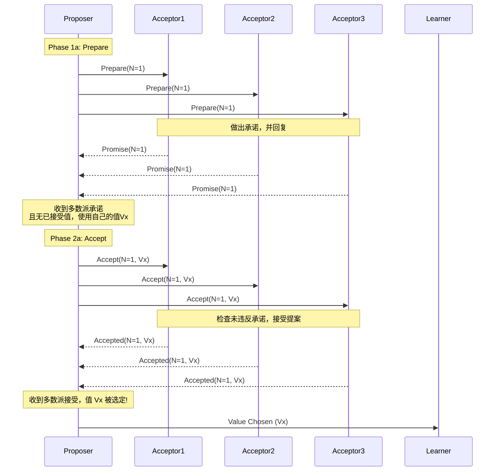
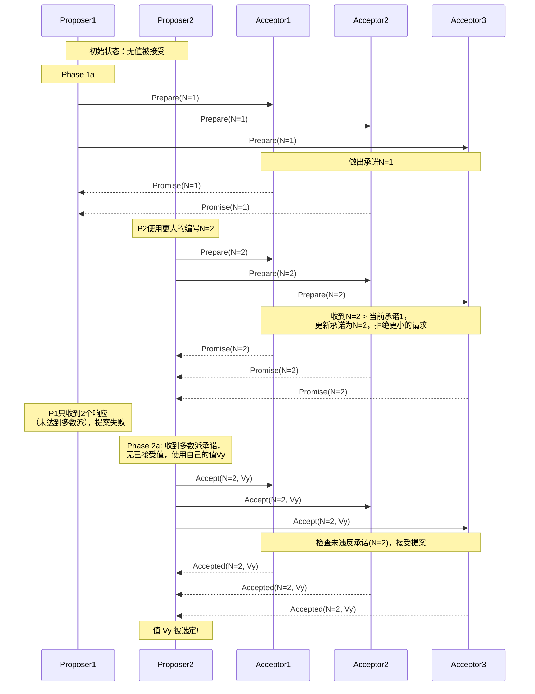
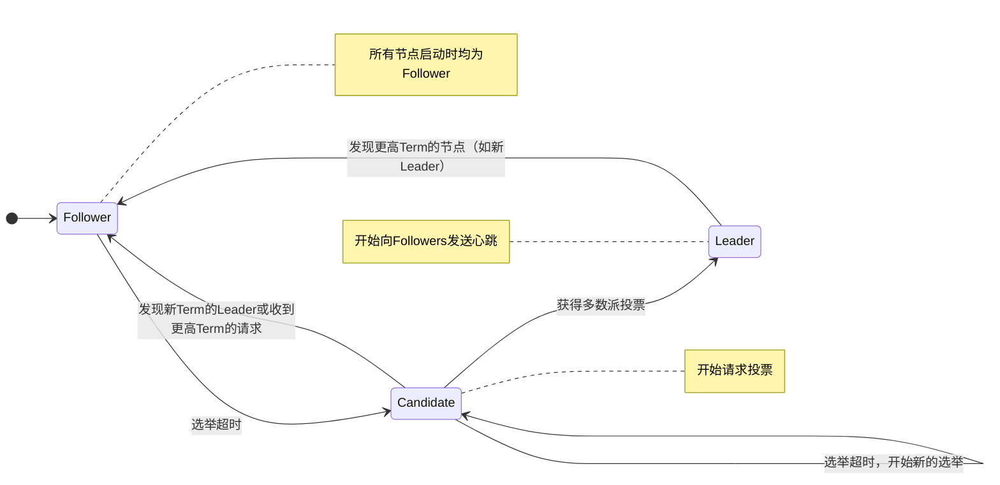
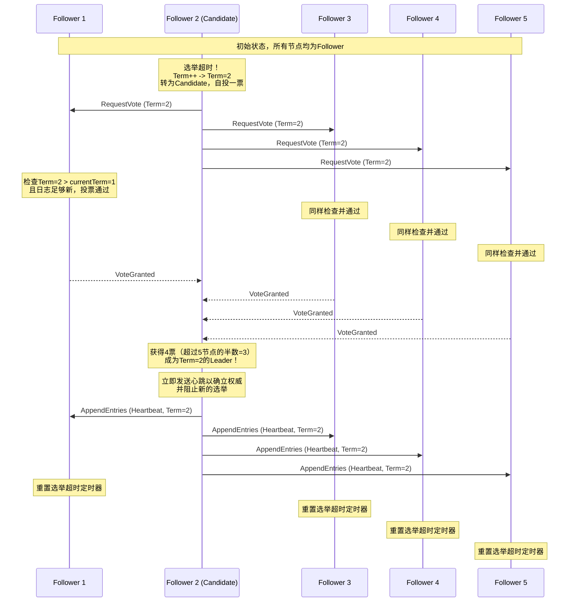
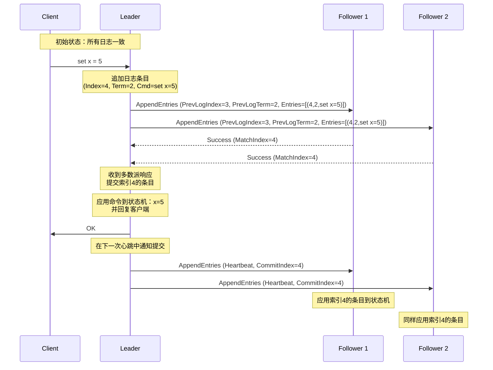
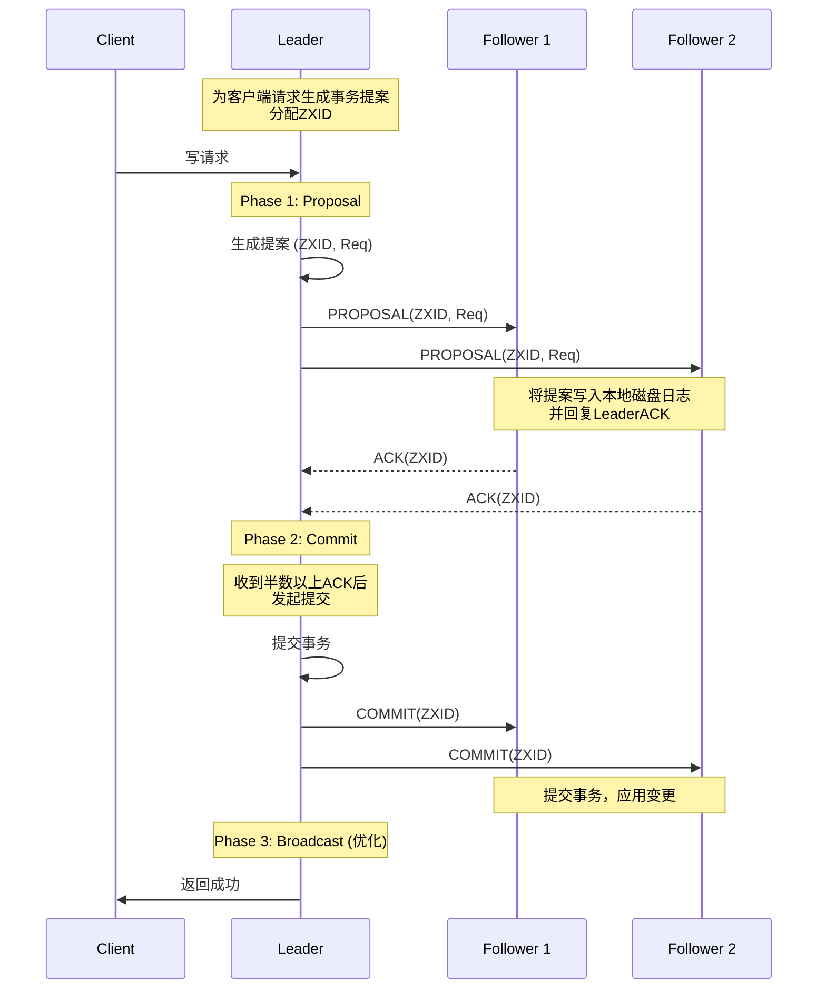
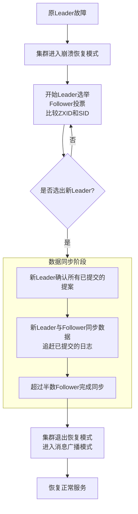

## 一、共识算法核心价值

在分布式系统中，共识算法是确保多个节点就某个值达成一致的基础机制。其核心价值在于：

1. **数据一致性**：确保所有节点维护相同的数据副本
2. **高可用性**：在部分节点故障时仍能继续工作
3. **容错性**：能够容忍网络分区和节点故障
4. **顺序性**：保证操作的全局顺序

## 二、Paxos：分布式共识的理论基础

### 1. Paxos 要解决什么问题？

在分布式系统中，多个节点需要通过通信来对某个值（value）达成一致。例如，在一个分布式数据库中，所有副本需要就“某个数据项的值是 X”达成一致。但系统存在各种问题：
*   机器可能宕机、重启。
*   网络可能延迟、丢失消息、重复消息。

Paxos 算法的目标就是**让一组节点在可能发生上述故障的情况下，就某个提议的值达成一致**，并且保证一旦一个值被确定，就不会再被更改。它是**共识（Consensus）** 算法的基石。

---

### 2. Paxos 中的三种角色

Paxos 算法中，一个节点可以扮演以下一个或多个角色：

1.  **Proposer (提议者)**： 接收客户端的请求，提出提案（Proposal）。提案包括一个唯一的**提案编号（Proposal ID）** 和要提议的**值（Value）**。
2.  **Acceptor (接受者)**： 对 Proposer 提出的提案进行**投票**和**接受**。它们是决策的主体，存储着已经接受的值。通常由多个 Acceptor 组成一个集群，以实现容错（只要超过半数的 Acceptor 节点正常，集群就能工作）。
3.  **Learner (学习者)**： **学习**被最终选定的值。不参与投票过程，只负责从 Acceptor 那里获取被批准的值并存储。客户端通常从 Learner 读取最终结果。

> **注意**： 在实际部署中，一个节点往往同时扮演 Proposer、Acceptor 和 Learner 三个角色，以简化系统架构。

---

### 3. 算法的核心：两个阶段

Paxos 算法的核心是 **“两阶段提交（Two-Phase）”** 过程。可以把它想象成一个议会流程：
1.  **Phase 1：准备阶段 (Prepare Phase)** - 拉取最新信息，争取投票承诺。
2.  **Phase 2：接受阶段 (Accept Phase)** - 提交正式的提案进行投票。

为了保证正确性，每个 Proposer 必须严格按顺序执行这两个阶段。

#### 阶段一：准备阶段 (Prepare Phase)

**目标**： Proposer 探测集群中是否已经有被批准的值，并让 Acceptor 承诺不再接受编号小于当前提案的提案。

1.  **Proposer**：
    *   生成一个**全局唯一且递增的提案编号 N** (例如，时间戳 + 服务器ID)。
    *   向**所有的 Acceptor** 发送 `Prepare(N)` 消息。

2.  **Acceptor**：
    *   收到 `Prepare(N)` 消息后，会做两个承诺和一个应答：
        *   **承诺1**： 不再接受任何**提案编号小于 N** 的 `Prepare` 请求。
        *   **承诺2**： 不再接受任何**提案编号小于 N** 的 `Accept` 请求。
    *   **应答**： 如果 Acceptor 没有违反上述承诺，它會回复一个 `Promise(N)` 消息。该消息包含：
        *   它之前**已经接受过的（如果有）提案中编号最大的那个提案**的编号和值（AcceptedN, AcceptedValue）。
        *   如果它从未接受过任何提案，则返回空。

#### 阶段二：接受阶段 (Accept Phase)

**目标**： Proposer 根据从第一阶段收集到的信息，提出一个值，让 Acceptor 接受。

1.  **Proposer**：
    *   如果它收到了**超过半数**的 Acceptor 的 `Promise` 响应，它就可以进入第二阶段。
    *   它需要从这些响应中找出**提案编号最大的那个值（AcceptedValue）**。
        *   如果所有响应中的 AcceptedValue 都为空，说明集群之前没有接受过任何值，那么 Proposer 就可以**自由选择**自己想要提议的值（Value）。
        *   如果响应中包含了值，那么 Proposer**必须**使用那个**编号最大的提案对应的值**作为本次提案的值，而不能用自己的值。**这是保证安全性的关键！**
    *   Proposer 向所有 Acceptor 发送 `Accept(N, Value)` 消息。

2.  **Acceptor**：
    *   收到 `Accept(N, Value)` 消息后，它会检查自己是否已经对**编号大于 N** 的 Prepare 请求做出了承诺（即违反了阶段一的承诺1）。
    *   **如果没有违反承诺**，那么它就**接受（Accept）** 这个提案，即把这个提案 (N, Value) 保存在本地，并回复一个 `Accepted(N, Value)` 消息给 Proposer（或所有的 Learner）。
    *   如果违反了承诺（即它已经响应过编号大于 N 的 Prepare 请求），它就会忽略这个 Accept 请求。

3.  **决议的形成**：
    *   如果 Proposer 收到了**超过半数**的 Acceptor 的 `Accepted` 响应，那么就意味着**值（Value）已经被选定（Chosen）**。
    *   Proposer 会通知所有的 Learner 这个被选定的值。

---

### 4. Mermaid 图示：正常流程

下面是一个没有竞争、一次成功的 Paxos 流程序列图。

---

### 5. Mermaid 图示：竞争与恢复流程

当有多个 Proposer 同时提案时，可能会发生冲突。Paxos 通过提案编号机制优雅地处理这种情况。

假设有两个 Proposer (P1 和 P2) 同时提案。

**关键点**： 编号更大的提案（P2，N=2）会“覆盖”编号小的提案（P1，N=1）的准备工作，从而使得小编号的提案无法获得多数派接受。这保证了即使有多个提案同时进行，最终也只有一个值能胜出。

---

### 6. 活锁 (Liveness) 问题与 Multi-Paxos

从上面的竞争流程可以看出，Paxos 可能存在**活锁**问题：两个 Proposer 不断生成递增的提案编号，相互覆盖对方的准备阶段，导致算法永远无法完成。

**解决方案**： 在实际应用中，通常会选举一个 **“唯一的领导者（Leader）”** 作为**唯一的 Proposer**。这个 Leader 由所有的 Acceptor 通过选举（例如运行一次 Paxos 来选Leader）产生。这样就从根源上避免了竞争，从而解决了活锁问题。这种优化后的模式称为 **Multi-Paxos**。

在 Multi-Paxos 中：
*   一旦 Leader 被选定，后续的所有提案都由这个 Leader 发起。
*   由于没有竞争，**阶段一（Prepare）只需要执行一次**，之后的所有提案都可以跳过阶段一，直接进行阶段二（Accept），大大提高了效率。

---

### 总结

| 特性 | 说明 |
| :--- | :--- |
| **目标** | 在不可靠的分布式系统中达成一致。 |
| **角色** | Proposer (提议), Acceptor (投票/决策), Learner (学习结果)。 |
| **核心** | 两阶段提交：准备阶段 (Prepare) 和 接受阶段 (Accept)。 |
| **关键** | **提案编号全局递增**；**接受者做出承诺**；**必须接受已有值**。 |
| **容错** | 只要**超过半数**的 Acceptor 节点正常工作，算法就能进行。 |
| **缺点** | 原始 Paxos 效率低，有活锁问题。 |
| **优化** | **Multi-Paxos**：选举唯一 Leader 作为主 Proposer，避免竞争，提升效率。 |

Paxos 算法理解起来有一定难度，但其设计的巧妙之处在于通过两个阶段和简单的承诺机制，优雅地解决了分布式共识的核心难题，为后来的 Raft、ZAB 等更易理解的算法奠定了坚实的基础。

## 三、Raft：易于理解的共识算法

### 1. Raft 要解决什么问题？

Raft 和 Paxos 一样，同属**分布式共识算法**，用于在多节点系统中就一系列值（通常是一条日志条目）达成一致。它同样要应对节点宕机、网络分区、消息延迟或丢失等问题。

Raft 通过两种方式提升可理解性：
1.  **问题分解**： 将共识问题分解为三个相对独立的子问题：
    *   **Leader 选举**： 系统中必须存在一个唯一的 Leader。
    *   **日志复制**： Leader 从客户端接收请求，并将日志条目复制到其他服务器节点。
    *   **安全性**： 保证任何状态机都不会执行错误的指令（例如，日志不一致性）。
2.  **状态简化**： 服务器在任何时候都处于三种明确的状态之一，逻辑更清晰。

---

### 2. Raft 中的三种角色状态

Raft 集群中的每个节点在任何时刻都处于以下三种状态之一：

1.  **Leader**： 负责处理所有客户端请求、管理日志复制。同一时刻有且只能有一个有效的 Leader。所有数据流都从 Leader 流向其他节点。
2.  **Follower**： 完全被动的角色。它们响应来自 Leader 或 Candidate 的请求，不会发起任何请求。
3.  **Candidate**： **候选人**状态，是节点在竞选 Leader 过程中的临时状态。

节点的状态转换关系如下图所示：

---

### 3. 核心概念：任期 (Term)

Raft 将时间划分为任意长度的**任期 (Term)**。
*   每个任期以一个**选举**开始。一个或多个 Candidate 尝试成为 Leader。
*   如果某个 Candidate 赢得选举，它将在该任期内担任 Leader，直到任期结束。
*   有时选举会**失败**（Split Vote），导致该任期没有 Leader。此时会立即开始一个新的任期并进行新一轮选举。
*   每个任期都有一个唯一的、单调递增的编号。它充当逻辑时钟，允许服务器检测过时的信息（例如来自旧 Leader 的请求）。

---

### 4. 算法的两个核心子问题

#### 子问题一：Leader 选举

**目标**： 当 Follower 一段时间内没有收到 Leader 的心跳（Heartbeat）时，认为集群没有 Leader，并发起选举以产生新的 Leader。

1.  **触发选举**：
    *   每个 Follower 都持有一个随机的**选举超时定时器**（通常为 150ms - 300ms）。
    *   如果在该时间内没有收到来自当前 Leader 的**心跳（AppendEntries RPC）**，则该 Follower 认为 Leader 已失联，**增加当前任期号**，并**转换为 Candidate 状态**。

2.  **拉取选票**：
    *   Candidate 首先**给自己投一票**。
    *   然后它向集群中的**所有其他节点**并行发送 `RequestVote RPC`（请求投票远程过程调用）。

3.  **节点投票**：
    *   每个节点在**一个任期内最多投出一票**，遵循**先到先得**的原则。
    *   节点只会投票给那些**日志至少和自己一样新**的 Candidate（这是一个重要的安全性限制）。

4.  **选举结果**：
    *   **赢得选举**： 如果 Candidate 在**同一任期内**收到了**超过半数**节点的投票，则它成为新的 Leader。
    *   **选举失败**： 如果 Candidate 在等待投票时，收到了来自**其他声称是 Leader** 的节点的 `AppendEntries RPC`，且该 RPC 中的任期号**不小于**自己的当前任期，则该 Candidate 会承认该 Leader 的合法性并退回 Follower 状态。
    *   **选举超时**： 如果多个 Candidate 同时竞选，导致票数分散，没有任何一个 Candidate 获得多数票。此时，每个 Candidate 会**等待自己的选举超时**（随机时间，减少了再次冲突的概率），**增加任期号**，并**发起新一轮投票**。

##### Mermaid 图示：Leader 选举流程

---

#### 子问题二：日志复制

**目标**： Leader 接收客户端命令，将其作为新条目追加到自己的日志中，并并行地将该条目复制到其他服务器上，最终通知所有服务器将该条目应用（Apply）到其状态机中。

1.  **接收请求**：
    *   客户端向 Leader 发送一个命令（例如 `set x = 5`）。
    *   Leader 将该命令作为一个**新日志条目**追加到自己的日志中。

2.  **复制日志**：
    *   Leader 通过下一次 `AppendEntries RPC`（心跳或新的日志条目），将这条新日志条目**并行地**发送给所有 Followers。
    *   当 Follower **成功接收**到日志条目后，会将其写入自己的本地日志，并回复 Leader **成功**。

3.  **提交日志**：
    *   一旦 Leader 确认**超过半数**的 Follower 已经复制了该日志条目，Leader 就**提交（Commit）** 该条目。
    *   Leader 将该条目**应用（Apply）** 到自己的状态机中，并**返回执行结果给客户端**。
    *   Leader 在后续的 `AppendEntries RPC`（包括心跳）中，会携带**已提交的最高日志索引（CommitIndex）**。
    *   Follower 在得知某个日志条目已被提交后，最终也会将其应用到自己的状态机中。

**日志的组成**：
*   每个日志条目包含三条信息：
    1.  **命令**： 状态机要执行的指令。
    2.  **索引**： 日志中的位置编号。
    3.  **任期号**： 该条目被创建时的 Leader 任期。
*   **日志匹配特性**是 Raft 安全性的核心：
    *   如果两个不同日志中的两个条目拥有**相同的索引和任期号**，那么它们存储了**相同的命令**。
    *   如果两个不同日志中的两个条目拥有**相同的索引和任期号**，那么它们**之前的所有日志条目也完全相同**。

##### Mermaid 图示：日志复制流程

---

### 5. Raft 的优势（对比 Paxos）

1.  **易于理解**： Raft 的算法逻辑被清晰地分解，状态更少，更容易被学习者掌握和实现。
2.  **领导强健性**： 所有客户端请求都必须经过 Leader，简化了日志的管理和复制流程。
3.  **成员变更**： Raft 包含了一个扩展算法用于安全地变更集群成员（增加或删除节点），而无需停止服务。

---

### 总结

| 特性 | Raft 的实现 |
| :--- | :--- |
| **目标** | 在不可靠的分布式系统中达成一致，**追求易于理解和实现**。 |
| **角色/状态** | **Leader**, **Follower**, **Candidate**。状态明确，职责清晰。 |
| **核心机制** | **任期 (Term)** 作为逻辑时钟；**随机选举超时**避免投票分裂；**心跳机制**维持领导。 |
| **日志安全** | **日志匹配特性** + **提交规则**（只能提交当前任期的日志条目）保证安全性。 |
| **容错** | 容忍 **（N-1）/ 2** 个节点故障（N 为集群总节点数）。 |
| **关键RPC** | `RequestVote RPC`（用于选举），`AppendEntries RPC`（用于心跳和日志复制）。 |

Raft 算法通过其清晰的设计，已经成为许多现代分布式系统（如 etcd, Consul, TiKV）的首选共识算法，是理解和构建强一致性分布式系统的绝佳起点。

## 四、ZAB：ZooKeeper的原子广播协议

### 1. ZAB 要解决什么问题？

ZAB 协议旨在为 ZooKeeper 这样一个分布式协调服务提供一个高效、可靠且具有崩溃恢复能力的主备模式数据同步方案。它需要解决以下核心问题：

1.  **消息原子广播**： 确保所有更新操作（写入请求）能够以**原子性**和**顺序性**的方式被所有服务器接收和应用。即，一个更新要么在所有服务器上成功，要么全部失败，并且所有服务器看到的操作顺序是一致的。
2.  **崩溃恢复**： 当 Leader 服务器发生故障时，集群能够快速选举出新的 Leader，并且新的 Leader 要能保证将系统状态恢复到故障前的某个一致状态，同时处理好与未提交日志的关系。
3.  **高吞吐与低延迟**： 作为协调服务的核心，需要具备高性能。

ZAB 协议将整个问题分解为两个模式：
*   **消息广播（原子广播）**： 在正常运行时，Leader 如何将客户端请求（事务提案）广播给所有 Follower。
*   **崩溃恢复（选举与数据同步）**： 在启动或 Leader 崩溃后，如何选举新 Leader 并同步数据。

---

### 2. ZAB 中的角色与核心概念

*   **角色**： 与 Raft 类似，集群中的服务器也分为 **Leader**、**Follower** 和 **Observer**（Observer 不参与决策过程）。ZAB 的核心是 Leader 和 Follower。
*   **ZXID**： 这是 ZAB 协议的核心数据结构之一。它是一个 64 位的长整数，分为两部分：
    *   **epoch**（纪元）： 高 32 位，代表领导周期。每次选举产生一个新的 Leader，epoch 就会递增。用于标识一个 Leader 的统治时期，区分不同的 Leader 周期，防止旧 Leader 的提案被提交。
    *   **counter**（计数器）： 低 32 位，是一个单调递增的流水号。由 Leader 在每个事务提案生成时赋予。同一个 epoch 内，counter 越大，数据越新。
*   **三阶段提交**： ZAB 的消息广播阶段基于一个优化过的二阶段提交（2PC）协议。

---

### 3. 算法的两种模式

#### 模式一：消息广播（原子广播）

在集群中存在一个正常运行的 Leader 时，ZAB 处于消息广播模式。其流程是对经典 2PC 的优化，去除了中断逻辑，所有 Follower 要么成功要么失败，由 Leader 来协调。

其消息广播流程如下图所示：

**流程说明**：
1.  **Proposal 阶段**： Leader 为客户端请求生成一个事务提案（Proposal），为其分配一个全局唯一的 ZXID，然后通过 **FIFO 信道**（TCP 链接保证）将 Proposal 广播给所有 Follower。
2.  **ACK 阶段**： Follower 收到 Proposal 后，会将其以事务日志的形式**持久化到磁盘**，然后向 Leader 发送一个 `ACK` 响应。
3.  **Commit 阶段**： 当 Leader 收到**超过半数** Follower 的 ACK 后，就认为提案已经可以被提交。Leader 会向所有 Follower 发送一个 `COMMIT` 消息，同时自身也会提交该事务。
4.  **交付应用**： Follower 收到 `COMMIT` 消息后，会将日志事务应用到内存数据库中。

> **优化点**： Leader 在广播 `PROPOSAL` 和 `COMMIT` 时，都会使用同一个 TCP 链接，严格遵循 FIFO 顺序，这天然保证了消息的顺序性。

---

### 模式二：崩溃恢复（选举与数据同步）

当集群启动或者 Leader 服务器宕机、网络分区导致与过半的 Follower 失去联系时，ZAB 会进入崩溃恢复模式。恢复模式主要分为两个步骤：**Leader 选举**和**数据同步**。

#### 步骤一：Leader 选举 (Fast Leader Election)

ZAB 的选举过程非常迅速，其目标是“**谁的数据最新，谁就当 Leader**”。这避免了繁琐的日志追赶过程，能快速产生一个可行的 Leader。

选举的核心规则是：Follower 在投票时，会将自己的最后接收的 ZXID (myLastZxid) 和自己的服务器 ID (sid) 作为选票信息发出。当其他服务器收到选票时，会按以下优先级进行比较：
1.  **比较 epoch**： 选举 epoch 大的服务器。
2.  **比较 ZXID**： 如果 epoch 相同，则选择 ZXID 最大的服务器。ZXID 越大，数据越新。
3.  **比较 sid**： 如果 ZXID 也相同（这种情况极少），则选择服务器 ID 最大的服务器。

通过这个规则，可以快速选出数据最接近最新的服务器作为新 Leader，从而最小化数据同步的开销。

#### 步骤二：数据同步

选举出新 Leader 后，需要与 Follower 进行数据同步，确保所有节点的状态一致后才开始对外提供服务（即重新进入**广播模式**）。

1.  **新 Leader 确认提交边界**： 新 Leader 会确认所有**已经提交**的提案（即之前 Leader 已经收到过半 ACK 的提案）。
2.  **同步过程**：
    *   新 Leader 会为每个 Follower 准备一个 **QUEUE**，将那些**已提交但 Follower 尚未提交**的提案逐个发送给 Follower。
    *   同时，Leader 也会将自身有而 Follower 没有的（或 Follower 有但需要被截断的）**未提交提案**进行同步或清理。
3.  **同步完成**： 当 Follower 成功同步了所有已提交的提案后，Leader 会将此 Follower 加入到“可用 Follower 列表”中。
4.  **集群可用**： 当**超过半数**的 Follower 完成数据同步后，新 Leader 才会正式成为公认的 Leader，集群退出恢复模式，重新进入**消息广播模式**。

其崩溃恢复与数据同步的整体流程如下图所示：

---

### 4. ZAB 与 Raft 的对比

| 特性 | ZAB (ZooKeeper) | Raft |
| :--- | :--- | :--- |
| **设计目标** | 为 ZooKeeper 设计的原子广播协议，强调**主备顺序一致性**。 | 通用的共识算法，强调**易于理解和实现**。 |
| **等价性** | 在本质上与 Raft 类似，都是**基于Leader**的共识算法。 | 与 ZAB 在容错和性能上目标一致。 |
| **状态标识** | **ZXID** (epoch + counter) | **Term** + **Index** |
| **提交时机** | Leader 需要等待**半数 ACK** 后才能提交**之前**的提案。 | Leader 在收到半数认可后即可提交**当前**日志条目。 |
| **选举原则** | ****Fast Leader Election**： 直接选择拥有最大 ZXID 的节点，数据同步开销最小。 | 投票基于 Term、Index 和候选人的日志完整性，可能选出的 Leader 需要更多日志追赶。 |
| **应用场景** | 专为 ZooKeeper 的**顺序一致性**和**写操作**设计，是其核心。 | 更通用，用于 etcd, Consul, TiKV 等众多系统。 |

---

### 总结

ZAB 协议是一个为 ZooKeeper 量身定制的、高效且强一致性的分布式共识算法。其核心思想可以概括为：

1.  **简化模型**： 所有写请求都由唯一的 Leader 处理，通过**优化过的二阶段提交**进行原子广播，保证了消息的顺序和原子性。
2.  **快速恢复**： 通过 **ZXID** 和 **Fast Leader Election** 机制，确保了在发生主节点故障时，能够快速选举出数据最全的新 Leader，并高效地完成数据同步，最大限度地减少系统不可用的时间。
3.  **一致性保证**： 其**崩溃恢复模式**和**消息广播模式**相互配合，确保了在任何时候，集群都能满足**顺序一致性**，即所有节点看到的操作顺序是相同的，并且已经提交的提案不会被丢失。

正是由于 ZAB 协议的设计，ZooKeeper 才能成为一个高性能、高可用的分布式协调服务。

## 参考资料
1. "Paxos Made Simple" - Leslie Lamport
2. "In Search of an Understandable Consensus Algorithm" - Diego Ongaro
3. ZooKeeper官方文档
