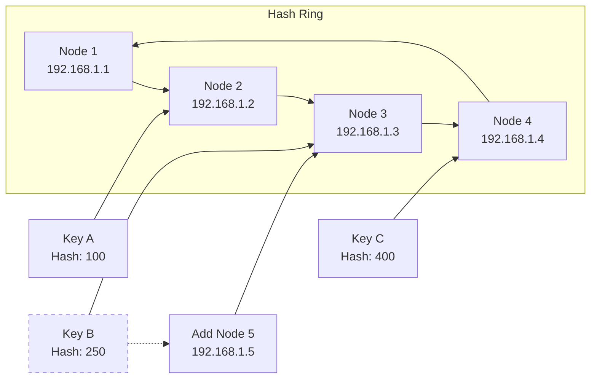
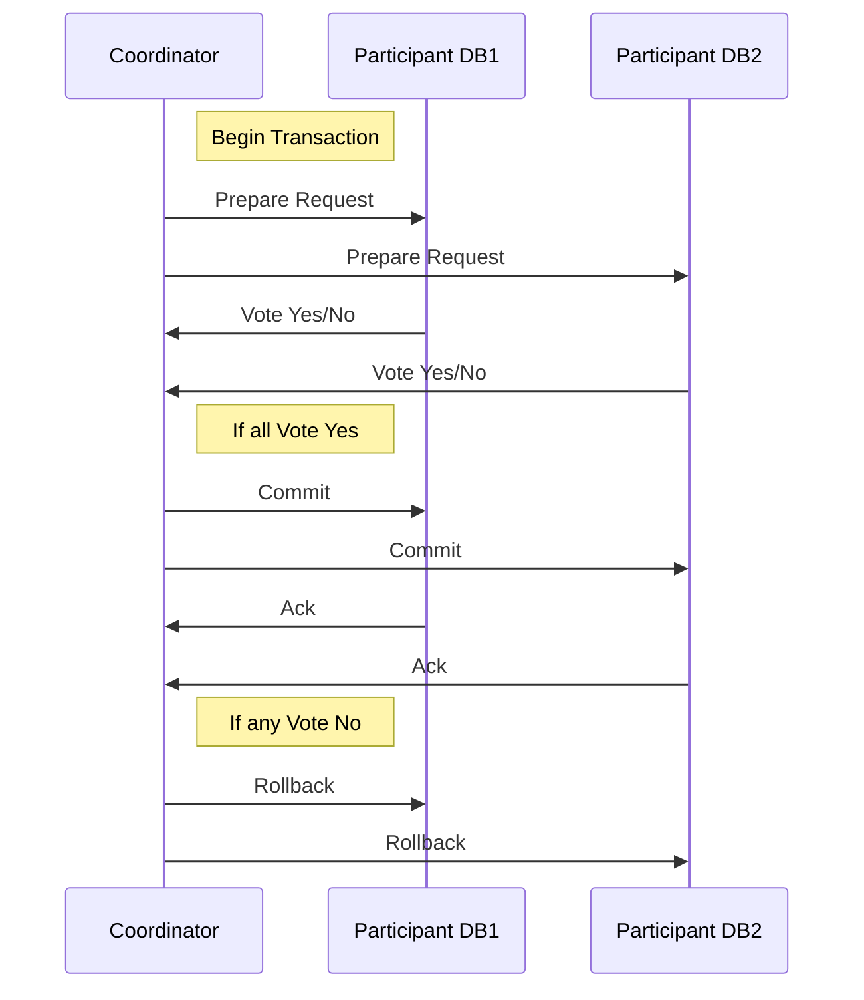
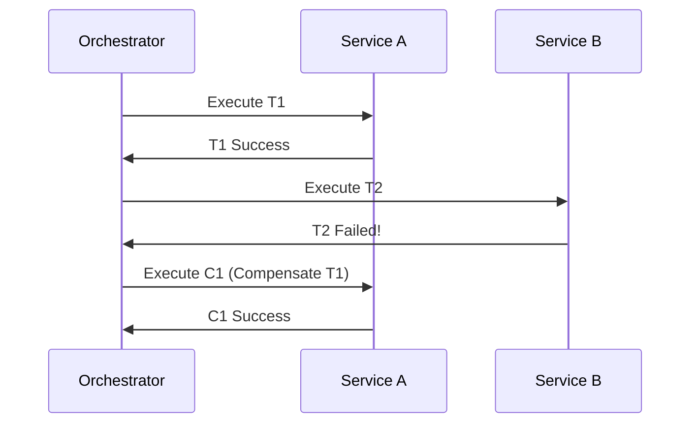

# 构建可扩展的现代应用：数据层架构设计深度解析

在当今数据驱动的时代，应用的性能、可用性和可扩展性极大地依赖于其数据层架构的设计。一个糟糕的数据层设计会成为整个系统的瓶颈，而一个优秀的架构则能支撑业务飞速成长。本文将深入探讨数据层设计的核心策略：数据分区、数据复制以及分布式事务解决方案，并提供基于PostgreSQL的实战示例。

## 1. 数据分区策略

当单台数据库服务器不堪重负时，第一选择往往是对数据进行分区（Sharding/Partitioning），将数据分散到多个物理节点上。

### 范围分区与哈希分区

**范围分区（Range Partitioning）** 按照某个关键值的范围（如时间、自增ID）来划分数据。
*   **优点**：范围查询效率高，易于管理。
*   **缺点**：容易产生数据热点（例如，最新的数据访问频繁）。

**哈希分区（Hash Partitioning）** 使用一个哈希函数对分片键进行计算，根据哈希值决定数据位置。
*   **优点**：数据分布均匀，不易产生热点。
*   **缺点**：无法直接支持范围查询，扩容时数据迁移量大。

以下是一个PostgreSQL声明式范围分区的示例：

```sql
-- 创建一个父表
CREATE TABLE sensor_data (
    log_date date not null,
    sensor_id int not null,
    reading float not null
) PARTITION BY RANGE (log_date);

-- 创建分区子表
CREATE TABLE sensor_data_2023_01 PARTITION OF sensor_data
    FOR VALUES FROM ('2023-01-01') TO ('2023-02-01');

CREATE TABLE sensor_data_2023_02 PARTITION OF sensor_data
    FOR VALUES FROM ('2023-02-01') TO ('2023-03-01');

-- 插入数据时，PostgreSQL会自动将数据路由到正确的分区
INSERT INTO sensor_data (log_date, sensor_id, reading)
VALUES ('2023-01-15', 1, 24.7);
```

### 一致性哈希算法实现平滑扩缩容

传统的哈希取模在节点数量变化时，会导致大量数据需要重新分布。一致性哈希算法通过构建一个哈希环，解决了这个问题。



如上图所示，当新增Node 5时，只有原本在Node 3上的部分数据（如Key B）需要迁移到Node 5，大大减少了数据移动量。

### 分片键选择与数据倾斜问题

分片键的选择至关重要，它决定了数据分布的均匀性。
*   **好的选择**：具有高基数的字段（如`user_id`），访问频率均匀。
*   **坏的选择**：低基数字段（如`country`）、经常用于范围查询的字段或单调递增的字段（如`created_at`）。

**数据倾斜**是指数据或负载集中分布在少数分片上。解决方法包括：
1.  选择更均匀的哈希键。
2.  使用复合分片键（如`(user_id, order_id)`）。
3.  在应用层进行二次哈希。

## 2. 数据复制方案

复制主要用于保证数据高可用、提升读性能以及实现灾备。

### 主从复制：读写分离实现

这是最常见的模式。一个主节点（Master）负责处理写操作，多个从节点（Replica）异步或同步地复制主节点数据，并承担读请求。

**PostgreSQL 流复制配置示例：**

在主库 (`postgresql.conf`)：
```ini
wal_level = replica
max_wal_senders = 10
hot_standby = on
```
在主库创建复制用户 (`psql`)：
```sql
CREATE ROLE replica_user WITH LOGIN REPLICATION PASSWORD 'your_strong_password';
```
在从库 (`postgresql.conf` 和 `standby.signal` 文件):
```ini
primary_conninfo = 'host=<master-ip> port=5432 user=replica_user password=your_strong_password'
```
创建 `standby.signal` 文件：
```bash
touch /var/lib/postgresql/data/standby.signal
```

**读写分离**：应用程序需配置不同的数据源，将写请求指向主节点，读请求随机或按权重分发到从节点。可以使用中间件（如 pgpool-II）来自动化这一过程。

### 多主复制：跨地域部署

多个节点都可以接受写操作，然后相互复制数据。适用于需要跨地域部署、就近写入的场景。

*   **优点**：写可用性高，延迟低。
*   **缺点**：极易发生写冲突（例如，两个用户在不同节点上修改了同一条数据的同一字段），解决冲突的逻辑非常复杂。

PostgreSQL本身不提供多主复制，但可以通过第三方扩展（如BDR）实现。

### 无主复制：Dynamo风格

在Cassandra、DynamoDB等系统中，没有主从概念。客户端可以向任意节点写入数据，该节点会将数据复制到N个副本节点，但不需要全部同意（只需W个节点确认即可）。

*   **优点**：极高的写可用性和低延迟。
*   **缺点**：是最终一致性模型，可能读到旧数据，需要处理版本冲突（如使用向量钟、Last-Write-Win）。

## 3. 分布式事务解决方案

在数据分区后，一个涉及多个分片的事务就变成了分布式事务。CAP定理告诉我们，无法同时满足一致性、可用性和分区容错性，因此产生了多种解决方案。

### 2PC/3PC：强一致性方案

**两阶段提交（2PC）** 包含一个协调者（Coordinator）和多个参与者（Participants）。
1.  **准备阶段**：协调者询问所有参与者"是否可以提交？"。参与者执行事务但不提交，并回答"Yes"或"No"。
2.  **提交阶段**：如果所有参与者都回答"Yes"，协调者发送"提交"命令；否则发送"回滚"命令。


*   **缺点**：同步阻塞、协调者单点故障、数据在准备阶段处于锁定状态。

### TCC：业务补偿型事务

TCC（Try-Confirm-Cancel）将事务分为两个阶段，但需要业务逻辑实现补偿机制。
1.  **Try**：预留业务资源（如冻结库存、预扣款）。
2.  **Confirm**：确认操作，使用预留的资源（真实扣款、减库存）。
3.  **Cancel**：取消操作，释放预留的资源（解冻库存）。

*   **优点**：最终一致性，性能较好。
*   **缺点**：业务侵入性极强，需要为每个操作实现补偿逻辑。

### Saga：长事务管理模式

Saga将一个大事务拆分为一系列本地小事务，每个小事务都有对应的补偿事务。
*   **执行方式**：
    *   **Choreography**：每个服务产生事件来触发下一个服务。
    *   **Orchestration**：由一个协调器（Orchestrator）来集中指挥每一步的执行和补偿。


*   **适用场景**：非常适合长业务流程。
*   **缺点**：编程模型复杂，且无法保证隔离性（其他事务可能看到Saga的中间状态）。

### 本地消息表：最终一致性实现

这是非常常用且实用的一种异步确保方式。
1.  在业务数据库中，有一个"消息表"。
2.  事务提交时，将需要发送的消息写入本地消息表。
3.  有一个定时任务轮询消息表，将消息发送给消息队列。
4.  下游消费者消费消息，处理业务，处理成功后确认消息。

**示例：下单减库存**
```sql
BEGIN;
-- 1. 本地业务操作
INSERT INTO orders (...) VALUES (...);
UPDATE inventory SET count = count - 1 WHERE product_id = 123;

-- 2. 将消息写入本地消息表
INSERT INTO message_queue (id, topic, payload, status)
VALUES (nextval('message_seq'), 'inventory-locked',
        '{"orderId": 10086, "productId": 123}', 'pending');

COMMIT; -- 本地事务保证业务和消息的原子性
```
*   **优点**：简单可靠，实现了最终一致性。
*   **缺点**：消息表会带来性能开销，且是异步的。

### 最大努力通知：弱一致性方案

适用于对一致性要求不高的场景，如结果通知。发起通知的一方，尽最大努力（重试N次）将通知发送给接收方，但不对最终结果做严格保证。接收方如果没有响应，通常需要提供一个查询接口，让发起方或用户来主动查询结果。
