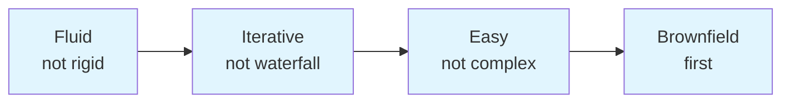
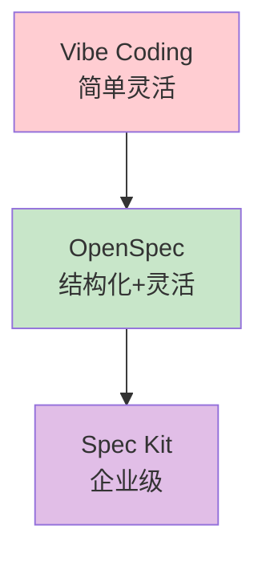
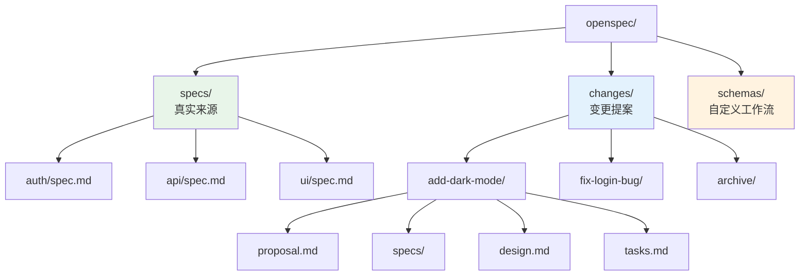
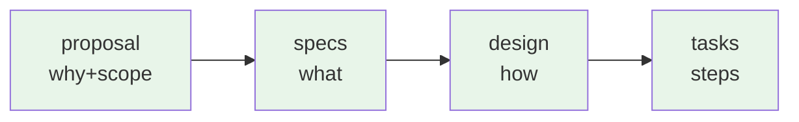
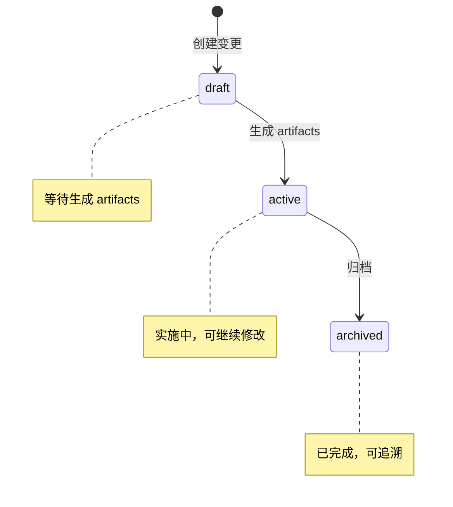
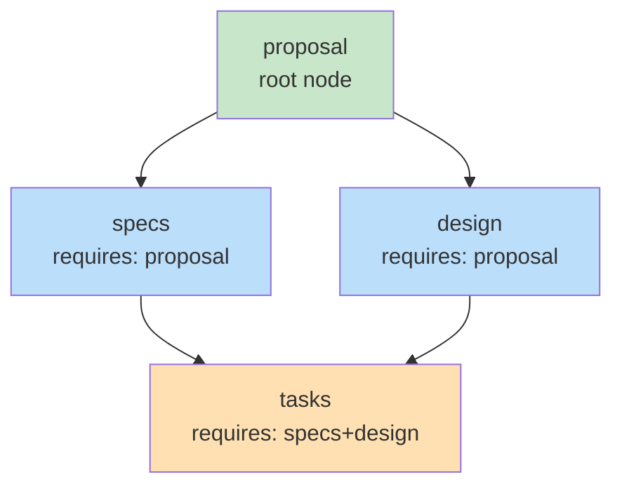

# AI 编程从失控到可控：OpenSpec 实战指南 + 架构深度解析

2025 年，AI 编程助手已经能够写出像样的代码，但一个根本性问题始终困扰着开发者：需求在聊天记录里，退出会话就找不回；每次让 AI 生成代码，结果都不一样；团队协作时，谁也不知道 AI 改了些什么。这种"凭感觉聊天"(Vibe Coding)的方式，让 AI 编程变成了昂贵的随机数生成器。

OpenSpec 的出现改变了这个局面。作为 GitHub 上增长最快的规范框架，它在不到一年内积累了 40,000+ 颗星标，成为 AI 编程领域的标杆实践。本文将深入解析 OpenSpec 的设计理念、架构原理，并通过多个真实场景展示其使用方式。

## 一、问题引入：AI 编程的三大困境

### 1.1 需求的脆弱性

当你和 AI 编程助手对话时，需求往往是这样的：

> "帮我加一个用户登录功能，要支持邮箱和 GitHub 登录"

这个需求看似清晰，但实际上存在大量模糊地带：会话过期时间是多少？错误处理怎么做？要不要支持双因子认证？安全策略是什么？

这些问题在当下的对话中没有被讨论，因为：
- 你没有想到
- AI 没有追问
- 当时看起来不重要

一周后，当你需要修改登录逻辑时，你会发现这些关键决策都消失在聊天记录里。你只能凭记忆回忆当初的想法，或者直接看代码猜意图。

### 1.2 结果的不可预测性

同一个需求，两次对话可能产生完全不同的代码：

```bash
# 第一次
你: "帮我加一个用户登录功能"
AI: 生成了基于 Passport.js 的实现

# 第二次（全新会话）
你: "帮我加一个用户登录功能"
AI: 生成了基于 JWT 的实现，API 设计完全不同
```

这是因为 AI 没有"记忆"，它只根据当下的上下文生成代码。即使是同一个人、用同一个工具、提同一个需求，结果也可能大相径庭。

### 1.3 协作的缺失

团队中使用 AI 编程时，困境更加明显：

- A 让 AI 加了一个功能
- B 让 AI 改了另一个功能
- 两人不知道彼此的要求有没有冲突
- 代码合并后，系统行为的变更没有文档化
- 新人加入时，只能看代码猜意图

**根本问题在于：需求没有被结构化地记录，AI 和人之间没有达成可验证的共识。**

## 二、核心概念：Spec-Driven Development

### 2.1 什么是规范驱动开发

OpenSpec 的核心思路其实很简单：**在写代码之前，先让 AI 和人达成共识**。

这个"共识"不是聊天记录中的几句话，而是存放在项目里的结构化文档。AI 可以读取这些文档，人类也可以查看和修订。这些文档有明确的格式，定义了：

- **要做什么** (Requirements)
- **什么情况下做什么** (Scenarios)
- **怎么做** (Design)
- **按什么步骤做** (Tasks)

有了这些文档，AI 的输出变得可预测、可追溯、可验证。

### 2.2 四大原则

OpenSpec 的设计哲学围绕四个核心原则：



| 原则 | 含义 | 为什么重要 |
|------|------|---------|
| **Fluid not rigid** | 无僵化阶段门控 | 工作流应该是连续的，不是分阶段的 |
| **Iterative not waterfall** | 迭代演进 | 需求会变化，规范需要跟随变化 |
| **Easy not complex** | 轻量 minimal 仪式 | 不要让规范成为负担 |
| **Brownfield-first** | 支持存量项目 | 大多数工作不是从零开始 |

**Fluid not rigid** 是最重要的原则。传统的规范系统要求你先完成所有规划，再开始编码。这在理论上很美好，但在实践中，需求往往在编码过程中才能真正理解。OpenSpec 允许你以任何顺序创建文档，按需迭代。

**Brownfield-first** 解决了另一个现实问题。大多数开发工作不是从零构建新系统，而是修改现有系统。OpenSpec 的 Delta Specs 机制专门为此设计：你只需要描述"什么在变化"，而不是重新写整个规范。

### 2.3 与传统方法的对比



| 对比维度 | Vibe Coding | Spec Kit | OpenSpec |
|---------|------------|----------|----------|
| 需求记录 | 聊天记录 | 完整 Markdown | 增量 Markdown |
| 更新机制 | 重新输入 | 重写整个文档 | Delta Specs |
| 工具锁定 | 无 | Python 环境 | 通用斜杠命令 |
| 学习成本 | 无 | 高 | 低 |
| 适用场景 | 简单脚本 | 企业项目 | 各类项目 |

## 三、架构详解：文件结构与核心机制

### 3.1 目录结构

OpenSpec 将规范信息存放在项目根目录的 `openspec/` 下：



**specs/** 是"真实来源"（Single Source of Truth），描述系统当前的行为。

**changes/** 是变更提案的集合。每个变更是一个独立的文件夹，包含了完成这个变更需要的所有信息。

### 3.2 Artifacts：规范文档家族

每个变更文件夹中包含四类文档，它们之间有依赖关系：



**Proposal (proposal.md)** 回答"为什么要做"和"做到什么程度"：

```markdown
# Proposal: Add Dark Mode

## Intent
用户请求深色模式，以减少夜间使用的眼睛疲劳，
并匹配系统级主题设置。

## Scope
In scope:
- 设置页面的主题切换开关
- 首次访问时检测系统主题偏好
- 在 localStorage 中持久化用户选择

Out of scope:
- 自定义主题颜色（未来工作）
- 页面级主题覆盖
```

**Specs (specs/)** 回答"系统应该做什么"，包含 Requirements 和 Scenarios：

```markdown
# Delta for UI

## ADDED Requirements

### Requirement: Theme Selection
系统 SHALL 提供主题切换功能，允许用户在浅色/深色主题间选择。

#### Scenario: Manual toggle
- GIVEN 用户在设置页面
- WHEN 用户点击主题切换开关
- THEN 主题切换为另一选项
- AND 用户选择被持久化到 localStorage

#### Scenario: First visit with system preference
- GIVEN 用户首次访问应用
- WHEN 系统检测到深色主题偏好
- THEN 应用使用深色主题
- AND 不显示主题切换UI（使用默认）
```

**Design (design.md)** 回答"技术层面怎么做"：

```markdown
# Design: Add Dark Mode

## Technical Approach
使用 React Context 管理主题状态，避免属性穿透。
CSS 自定义属性（CSS Custom Properties）实现运行时主题切换。

## Architecture Decisions

### Decision: Context over Redux
选择 React Context 而非 Redux，因为：
- 主题状态简单（仅 light/dark 二元值）
- 无复杂状态转换
- 避免引入额外依赖

### Decision: CSS Custom Properties
选择 CSS 变量而非 CSS-in-JS，因为：
- 兼容现有样式表
- 无运行时开销
- 浏览器原生支持

## Data Flow
ThemeProvider (context)
       │
       ▼
ThemeToggle ◄──► localStorage
       │
       ▼
CSS Variables (applied to :root)

## File Changes
- src/contexts/ThemeContext.tsx (new)
- src/components/ThemeToggle.tsx (new)
- src/styles/globals.css (modified)
```

**Tasks (tasks.md)** 是实现检查清单：

```markdown
# Tasks

## 1. Theme Infrastructure
- [ ] 1.1 Create ThemeContext with light/dark state
- [ ] 1.2 Add CSS custom properties for colors
- [ ] 1.3 Implement localStorage persistence
- [ ] 1.4 Add system preference detection

## 2. UI Components
- [ ] 2.1 Create ThemeToggle component
- [ ] 2.2 Add toggle to settings page
- [ ] 2.3 Update Header to include quick toggle

## 3. Styling
- [ ] 3.1 Define dark theme color palette
- [ ] 3.2 Update components to use CSS variables
- [ ] 3.3 Test contrast ratios for accessibility
```

### 3.3 Delta Specs：增量之美

OpenSpec 最重要的创新是 Delta Specs——它不要求你重写整个规范，而是只记录"什么在变化"。

在 `specs/` 目录下的规范文件中，你只需要使用三个标记：

```markdown
## ADDED Requirements        # 新增的行为
## MODIFIED Requirements    # 修改的行为
## REMOVED Requirements   # 删除的行为
```

**为什么 Delta 比全量更好？**

1. **更清晰**：审阅者只需关注变化的部分
2. **无冲突**：多个变更可以同时修改同一文件的不同部分
3. **适合存量项目**：增量描述比全量重写更高效

假设你有一个包含 50 条规则的认证规范，现在要添加双因子认证：

**全量方式**：你需要重新阅读整个 50 条规范，然后写第 51 条。

**Delta 方式**：你只需写：

```markdown
## ADDED Requirements

### Requirement: Two-Factor Authentication
The system MUST support TOTP-based two-factor authentication.

#### Scenario: 2FA enrollment
GIVEN a user without 2FA enabled
WHEN the user enables 2FA in settings
THEN a QR code is displayed for authenticator app setup
```

### 3.4 Archive：变更的终结

当一个变更完成后，你需要将其归档（archive）：

```
归档前:
openspec/
├── specs/auth/spec.spec                    ← 当前规范
└── changes/add-2fa/
    ├── proposal.md
    └── specs/auth/spec.spec              ← 增量规范

归档后:
openspec/
├── specs/auth/spec.spec              ← 已合并增量
└── changes/archive/2025-01-20-add-2fa/
    ├── proposal.md                  ← 可追溯历史
    └── specs/auth/spec.spec
```

归档过程：
1. 读取变更的 Delta Specs
2. 解析 ADDED/MODIFIED/REMOVED 部分
3. 合并到主规范文件
4. 将变更移动到 archive 目录

这个过程确保了：
- 规范始终保持最新
- 历史变更可追溯
- 代码行为演变有文档记录

## 四、命令原理详解：状态机与执行逻辑

### 4.1 Change 的生命周期

每个变更（Change）经历三种状态：



- **draft**: 变更文件夹已创建，等待生成 artifacts
- **active**: artifacts 已就绪正在实施或已完成
- **archived**: 已归档到历史，delta specs 已合并到主规范

### 4.2 Artifacts 依赖图

每个 artifact 不是凭空生成的，而是有依赖关系：



这意味着：
- **proposal** 是根节点，可以最先创建
- **specs** 和 **design** 可以在 proposal 后并行创建
- **tasks** 必须等 specs 和 design 都完成后才能创建

### 4.3 核心命令深度解析

#### `/opsx:propose`

**触发条件**: 用户想创建变更并一步生成所有 artifacts

**文件操作**:
1. 创建 `openspec/changes/<change-name>/` 目录
2. 生成 `.openspec.yaml` 元数据
3. 按 schema 顺序创建 proposal.md、specs/、design.md、tasks.md

**状态变更**: 无 → draft → active

```bash
# 用户输入
/opsx:propose add-dark-mode

# OpenSpec 内部
1. mkdir openspec/changes/add-dark-mode
2. write .openspec.yaml (schema: spec-driven, created: 2025-01-20)
3. generate proposal.md (基于用户描述)
4. generate specs/ui/spec.md (基于 proposal)
5. generate design.md (基于 proposal + specs)
6. generate tasks.md (基于 design)
```

#### `/opsx:explore`

**触发条件**: 需求不明确，需要先探索

**文件操作**: 无（纯对话探索）

**状态变更**: 无（保持原状态）

这个命令不会创建任何文件，它开启一段探索性对话。当你：
- 不确定需求细节
- 需要调查代码库
- 想比较不同方案

可以用它来理清思路，然后转到 `/opsx:propose`。

#### `/opsx:new`

**触发条件**: 想逐步创建 artifacts

**文件操作**:
1. 创建变更目录
2. 创建 `.openspec.yaml`

**状态变更**: 无 → draft

这与 `/opsx:propose` 的区别在于：它只创建基础结构，后续 artifacts 需要用 `/opsx:continue` 逐步生成。

#### `/opsx:continue`

**触发条件**: 想一次创建一个 artifact

**文件操作**:
1. 查询 artifact 依赖图
2. 找到"就绪"状态的 artifact（依赖已满足）
3. 读取依赖文件获取上下文
4. 生成该 artifact

**状态变更**: 保持 active

```bash
# 依赖状态查询
Artifact status:
  ✓ proposal    (done)
  ◆ specs       (ready)    ← 可以创建
  ◆ design      (ready)    ← 可以创建（并行）
  ○ tasks       (blocked)   ← 等待 specs + design
```

#### `/opsx:ff` (Fast-Forward)

**触发条件**: 需求清晰，想快速生成所有 artifacts

**文件操作**: 按依赖顺序批量创建所有 pending artifacts

**状态变更**: draft → active

这是 `/opsx:continue` 的批量版本，一次性创建所有就绪的 artifacts。

#### `/opsx:apply`

**触发条件**: 开始实施变更

**文件操作**:
1. 读取 tasks.md
2. 找到未完成的任务（`-[ ]`）
3. 执行任务（写代码、创建文件）
4. 标记任务完成（`-[x]`）

**状态变更**: 标记 checkboxes

```bash
# 读取 tasks.md
- [ ] 1.1 Create ThemeContext
- [ ] 1.2 Add CSS custom properties
- [ ] 1.3 Implement localStorage persistence

# 执行第一个任务
- 创建 src/contexts/ThemeContext.tsx
- 标记为完成

# 更新 tasks.md
- [x] 1.1 Create ThemeContext
- [ ] 1.2 Add CSS custom properties
- [ ] 1.3 Implement localStorage persistence
```

#### `/opsx:verify`

**触发条件**: 实施完成后验证

**文件操作**: 无写入（纯检查）

**状态变更**: 生成验证报告

验证三个维度：

**Completeness（完整性）**:
- 所有 tasks 是否完成？
- 所有 requirements 是否有对应代码？
- 所有 scenarios 是否被覆盖？

**Correctness（正确性）**:
- 代码是否实现了规范意图？
- Edge cases 是否处理？
- 错误状态是否符合定义？

**Coherence（一致性）**:
- 设计决策是否反映在代码中？
- 命名是否一致？
- 模式是否统一？

```bash
# 验证输出示例
Verifying add-dark-mode...

COMPLETENESS
✓ All 8 tasks in tasks.md are checked
✓ All requirements in specs have corresponding code
⚠ Scenario "System preference detection" has no test coverage

CORRECTNESS
✓ Implementation matches spec intent
✓ Edge cases from scenarios are handled
✓ Error states match spec definitions

COHERENCE
✓ Design decisions reflected in code structure
✓ Naming conventions consistent with design.md
⚠ Design mentions "CSS variables" but implementation uses Tailwind

SUMMARY
─────────────────────────────
Critical issues: 0
Warnings: 2
Ready to archive: Yes (with warnings)
```

#### `/opsx:archive`

**触发条件**: 变更完成，准备终结

**文件操作**:
1. 检查 artifacts 完整性
2. 检查 tasks 完成度
3. 可选：同步 delta specs
4. 移动到 archive 目录

**状态变更**: active → archived

```bash
# 归档前检查
Artifact status:
  ✓ proposal.md exists
  ✓ specs/ exists
  ✓ design.md exists
  ✓ tasks.md exists (8/8 tasks complete)

# 同步 delta specs（可选）
Delta specs: Not yet synced
→ Sync now? (recommended)

# 执行归档
✓ Synced specs to openspec/specs/ui/spec.md
✓ Moved to openspec/changes/archive/2025-01-24-add-dark-mode/
```

### 4.4 Delta Specs 合并算法

当执行 `/opsx:archive` 或 `/opsx:sync` 时，OpenSpec 如何合并 Delta Specs？

**ADDED（新增）**:
```markdown
## ADDED Requirements
### Requirement: New Feature
The system SHALL ...
```
→ 追加到主规范文件的对应章节末尾

**MODIFIED（修改）**:
```markdown
## MODIFIED Requirements
### Requirement: Session Timeout
The system MUST expire sessions after 15 minutes.
(Previously: 30 minutes)
```
→ 替换主规范中同名的 requirement

**REMOVED（删除）**:
```markdown
## REMOVED Requirements
### Requirement: Remember Me
(Deprecated in favor of 2FA)
```
→ 从主规范中删除该 requirement，并添加注释说明原因

**并发冲突处理**:
当多个变更同时修改同一 requirement 时：
1. 检查两个变更是否都已在代码中实现
2. 如果是，按创建时间先后合并（后者覆盖前者）
3. 如果只有一个实现，使用已实现的版本

## 五、场景案例

以下六个场景覆盖了最常见的使用情况。每个场景都提供完整的命令和预期输出，小白用户可以直接复制执行。

### 5.1 场景一：新项目从零开始

**场景**：启动一个全新的 React 项目，需要规划初始架构

#### 步骤 1：安装 OpenSpec

```bash
# 全局安装
npm install -g @fission-ai/openspec

# 验证安装
openspec --version
```

#### 步骤 2：创建新项目并初始化

```bash
# 创建项目目录
mkdir my-new-project && cd my-new-project
git init

# 初始化 OpenSpec
openspec init
```

**预期输出**：
```
✅ OpenSpec initialized!
📁 Created openspec/specs/
📁 Created openspec/changes/
📁 Created openspec/config.yaml
```

#### 步骤 3：在 AI 助手中创建第一个变更

在 Claude Code / Cursor / Windsurf 中输入：

```
/opsx:propose initial-setup
```

**AI 会自动生成**：
```
Created openspec/changes/initial-setup/
├── proposal.md       # 项目意图
├── specs/           # 规范目录
│   └── project/
│       └── spec.md
├── design.md        # 技术设计
└── tasks.md         # 任务清单
```

#### 步骤 4：查看生成的规范

查看 `openspec/changes/initial-setup/proposal.md`：

```markdown
# Proposal: Initial Setup

## Intent
Set up the initial project structure and core features.

## Scope
In scope:
- Project initialization
- Basic routing
- Authentication setup

Out of scope:
- Advanced features
- Performance optimization
```

#### 步骤 5：实施任务

```
/opsx:apply
```

AI 会逐个执行 tasks.md 中的任务并打勾。

#### 步骤 6：归档变更

```
/opsx:archive
```

**预期输出**：
```
Archiving initial-setup...
✓ Synced specs to openspec/specs/
✓ Moved to openspec/changes/archive/2025-01-20-initial-setup/
```

---

### 5.2 场景二：存量项目添加功能

**场景**：为现有电商网站添加购物车功能

#### 步骤 1：进入项目并探索

```bash
cd your-existing-project
openspec init   # 如果还没有初始化
```

#### 步骤 2：在 AI 助手中探索现有代码

```
/opsx:explore

How is the product catalog implemented? What database do you use?
```

**AI 会分析你的代码库**，输出类似：

```
我分析了你的代码库：
- 使用 PostgreSQL + Prisma
- 产品数据在 src/models/product.ts
- 现有 API: GET /api/products, GET /api/products/:id
```

#### 步骤 3：创建购物车功能变更

```
/opsx:propose add-shopping-cart
```

#### 步骤 4：编辑 Delta Specs

打开 `openspec/changes/add-shopping-cart/specs/cart/spec.md`，修改为：

```markdown
# Delta for Cart

## ADDED Requirements

### Requirement: Add to Cart
用户 SHALL 能够将商品添加到购物车。

#### Scenario: Add available item
- GIVEN 商品有库存
- WHEN 用户点击"加入购物车"
- THEN 商品被添加到购物车
- AND 购物车数量更新

#### Scenario: Out of stock
- GIVEN 商品无库存
- WHEN 用户点击"加入购物车"
- THEN 显示"缺货"提示
- AND 不添加购物车

### Requirement: Cart Persistence
购物车内容 SHALL 持久化到 localStorage。

## IN SCOPE
- 添加/移除商品
- 数量调整
- localStorage 持久化

## OUT OF SCOPE
- 支付流程
- 库存同步
- 多人购物车共享
```

#### 步骤 5：查看生成的设计

查看 `design.md`：

```markdown
# Design: Add Shopping Cart

## Technical Approach
使用 React Context + localStorage 管理购物车状态。

## File Changes
- src/contexts/CartContext.tsx (new)
- src/hooks/useCart.ts (new)
- src/components/CartIcon.tsx (new)
- src/pages/ProductPage.tsx (modified)
```

> **💡 注意**：如果你修改了 Delta Specs，需要重新生成 design 和 tasks：

```bash
/opsx:ff add-shopping-cart
```

**预期输出**：
```
Fast-forwarding add-shopping-cart...

✓ Creating design.md
✓ Creating tasks.md

All planning artifacts complete!
```

这是因为 `/opsx:propose` 在初次生成时只读取了一次 specs，后续修改 specs 后需要重新触发。

#### 步骤 6：实施

```
/opsx:apply
```

AI 会依次创建文件：
- ✅ 创建 CartContext
- ✅ 创建 useCart hook
- ✅ 创建 CartIcon 组件
- ✅ 修改 ProductPage

#### 步骤 7：验证

```
/opsx:verify
```

**预期输出**：
```
COMPLETENESS
✓ All 5 tasks complete
✓ All requirements implemented

CORRECTNESS
✓ Edge cases handled
✓ Error states match spec

COHERENCE
✓ Design decisions reflected
Ready to archive: Yes
```

#### 步骤 8：归档

```
/opsx:archive
```

---

### 5.3 场景三：修 Bug

**场景**：用户报告登录后立即被登出

#### 步骤 1：探索问题

```
/opsx:explore

用户登录后立即被登出。请调查：
1. Session 是如何创建的
2. Cookie 是如何设置的
3. 过期时间是多少
```

**AI 输出**：
```
找到问题原因：
- Session 过期时间设置为 0
- Cookie 缺少 secure 标志
文件位置：src/auth/session.ts:45
```

#### 步骤 2：创建 Bug 修复变更

```
/opsx:propose fix-session-expiry-bug
```

#### 步骤 3：编辑规范

打开 `openspec/changes/fix-session-expiry-bug/specs/auth/spec.md`：

```markdown
# Delta for Auth

## MODIFIED Requirements

### Requirement: Session Expiration
The system MUST NOT expire sessions within 30 minutes of activity.

#### Scenario: Active session
- GIVEN 已认证用户
- WHEN 用户在 30 分钟内进行操作
- THEN 会话保持活跃

#### Scenario: Session expiry (FIX)
- GIVEN 已认证用户
- WHEN 30 分钟无活动
- THEN 会话过期
- AND 重定向到登录页

#### Scenario: Session created (REGRESSION)
- GIVEN 用户成功登录
- THEN 创建会话
- AND 设置 cookie 为 30 分钟
- AND 包含 secure 和 httpOnly 标志
```

#### 步骤 4：查看 Tasks

```markdown
# Tasks

## 1. Fix Session Expiration
- [ ] 1.1 Update session expiry to 30 minutes in session.ts
- [ ] 1.2 Add secure and httpOnly flags to cookie

## 2. Test Login Flow
- [ ] 2.1 Verify login creates session with correct expiry
- [ ] 2.2 Verify active sessions stay alive
- [ ] 2.3 Verify expired sessions redirect to login
```

#### 步骤 5：实施修复

```
/opsx:apply
```

#### 步骤 6：验证修复

```
/opsx:verify
```

**预期输出**：
```
COMPLETENESS
✓ All 5 tasks complete
✓ All scenarios have tests

CORRECTNESS
✓ Fix addresses root cause
✓ Regression scenario included

Ready to archive: Yes
```

#### 步骤 7：归档

```
/opsx:archive
```

---

### 5.4 场景四：重构

**场景**：将 jQuery 代码迁移到 React

#### 步骤 1：探索现有代码

```
/opsx:explore

Find jQuery code in the homepage. What does it do? What are the dependencies?
```

**AI 输出**：
```
找到 jQuery 代码：
- src/pages/home/index.js: 200行 jQuery
- 功能：轮播图、标签页切换、AJAX 加载

主要依赖：
- jQuery 3.x
- Bootstrap 4
```

#### 步骤 2：创建重构变更

```
/opsx:propose migrate-homepage-to-react
```

#### 步骤 3：定义范围和约束

```markdown
# Proposal: Migrate Homepage to React

## Intent
将首页从 jQuery 迁移到 React 组件。

## Scope
In scope:
- 首页组件
- 轮播图
- 标签页
- AJAX 内容加载

Out of scope:
- 其他页面
- 新功能

## Compatibility Constraints (必须保持不变)
- API 接口不变
- URL 结构不变
- 用户交互行为不变
- 视觉外观不变
```

#### 步骤 4：渐进式迁移设计

```markdown
# Design: Migration Strategy

## Phased Approach

### Phase 1: Setup (Week 1)
- 安装 React 依赖
- 创建基础组件结构
- 设置 webpack/vite

### Phase 2: Components (Week 2)
- Carousel 组件
- Tabs 组件
- ContentLoader 组件

### Phase 3: Integration (Week 3)
- 替换 jQuery 为 React
- 保持 API 调用不变

### Phase 4: Cleanup (Week 4)
- 移除 jQuery 依赖
- 清理旧代码
```

#### 步骤 5：实施第一阶段

```
/opsx:ff    # 快速生成所有 artifacts
```

查看 tasks.md 并执行：
```
/opsx:apply
```

#### 步骤 6：每阶段验证

```
/opsx:verify
```

每次验证确保：
- ✅ 现有功能不受影响
- ✅ 新组件正常工作

#### 步骤 7：归档

```
/opsx:archive
```

---

### 5.5 场景五：团队协作

**场景**：团队中多人同时使用 AI 编程

#### 步骤 1：团队初始化

每个团队成员在本地执行：

```bash
git clone your-project
cd your-project
openspec init   # 如果没有初始化
openspec update # 更新 AI 指令
```

#### 步骤 2：创建并行变更

**开发者 A** 创建变更：

```
/opsx:propose add-user-profile-page
```

**开发者 B** 创建变更：

```
/opsx:propose add-admin-dashboard
```

#### 步骤 3：独立实施

- A 实施 `add-user-profile-page`
- B 实施 `add-admin-dashboard`

#### 步骤 4：各自验证

A 执行：
```
/opsx:verify add-user-profile-page
```

B 执行：
```
/opsx:verify add-admin-dashboard
```

#### 步骤 5：代码审查

- 提交 PR
- 人工代码审查
- 合并代码

#### 步骤 6：批量归档

```
/opsx:bulk-archive
```

**预期输出**：
```
Found 2 completed changes:
- add-user-profile-page
- add-admin-dashboard

Checking for spec conflicts...
✓ No conflicts detected

Archive both? (yes/no): yes
✓ Archived add-user-profile-page
✓ Archived add-admin-dashboard
```

---

### 5.6 场景六：紧急修复（Hotfix）

**场景**：线上出现紧急 bug，需要快速修复

#### 步骤 1：快速创建变更

```
/opsx:propose hotfix-payment-redirect
```

#### 步骤 2：极简规范

打开 proposal.md，直接写：

```markdown
# Hotfix: Payment Redirect Bug

## Intent
修复支付成功后跳转到 /undefined 的问题

## Bug
用户支付完成后被重定向到 /undefined

## Root Cause
支付回调返回的 nextUrl 为 undefined
```

#### 步骤 3：极简 Tasks

```markdown
# Tasks

## Fix
- [ ] 1.1 Fix nextUrl handling in paymentCallback.ts:42
- [ ] 1.2 Add fallback to /dashboard

## Test
- [ ] 2.1 Test successful payment flow
```

#### 步骤 4：快速实施

```
/opsx:apply
```

#### 步骤 5：快速验证

```
/opsx:verify
```

#### 步骤 6：立即归档

```
/opsx:archive
```

#### Hotfix 简化规则

| 环节 | 简化方式 |
|------|---------|
| proposal | 只写 Bug 描述和 Root Cause |
| design | 跳过，必要时补充 |
| tasks | 极简，1-2 个任务 |
| verify | 可选 |
| archive | 立即执行 |

## 六、CLI 与配置

### 6.1 常用终端命令

```bash
# 初始化项目
openspec init

# 更新 AI 指令
openspec update

# 列出变更
openspec list

# 查看状态
openspec status

# 配置
openspec config

# 创建自定义 schema
openspec schema init my-workflow
```

### 6.2 配置项

在 `openspec/config.yaml` 中可以配置：

```yaml
 # 工作流配置
 profile: core  # 或 expanded

 # 默认 schema
 schema: spec-driven

 # 规范路径
 specsDir: openspec/specs
 changesDir: openspec/changes

 # AI 行为
 model: claude-opus-4-5-20251101
```

### 6.3 Profile 选择

| Profile | 命令 | 适用场景 |
|---------|------|---------|
| **core** | `/opsx:propose`, `/opsx:apply`, `/opsx:archive` | 快速工作流 |
| **expanded** | `/opsx:new`, `/opsx:continue`, `/opsx:ff` | 精细控制 |

## 七、最佳实践

### 7.1 Lite Spec vs Full Spec

**Lite Spec（默认）**：
- 几个关键 requirements
- 2-3 个核心 scenarios
- 简明扼要

**Full Spec（高风险场景）**：
- 完整的 requirements 列表
- 所有 edge cases 的 scenarios
- 详细的验收标准

**何时用 Full Spec**：
- 跨团队变更
- API/契约变更
- 涉及安全/隐私
- 容易产生歧义的变更

### 7.2 模型选择

OpenSpec 官方推荐：

- **规划阶段**：Claude Opus 4.5 或 GPT 5.2（推理能力强）
- **实施阶段**：任何支持代码生成的模型

**原因**：规划需要更好的推理能力来理解需求和设计架构；实施阶段更依赖领域知识。

### 7.3 上下文卫生

- 开始实施前清理上下文
- 定期检查上下文长度
- 复杂变更分步进行

### 7.4 常见陷阱

| 陷阱 | 建议 |
|------|------|
| 规范过于详细 | 先 Lite Spec，迭代补充 |
| 跳过验证 | 每次归档前 `/opsx:verify` |
| 不习惯用 Delta | 存量项目从小变更开始练习 |
| 多人无协调 | 使用代码审查 + verify |

## 八、总结

OpenSpec 解决了一个根本问题：**让 AI 编程从"凭感觉"变成"按规范"**。

它的核心价值：

1. **可预测性**：AI 按照明确的规范输出代码
2. **可追溯性**：需求从聊天记录走进项目文件
3. **可验证性**：从格式到语义的多层检查
4. **灵活性**：轻量工作流，不增加负担

AI 编程已经足够强大，缺的不是能力，而是约束。OpenSpec 正是这样一套约束系统，让 AI 的能力在明确的轨道上发挥作用。

---

### 立即行动

1. **安装**：`npm install -g @fission-ai/openspec`
2. **初始化**：在你的项目中运行 `openspec init`
3. **体验**：输入 `/opsx:onboard` 开始交互式教程

如果你已经在使用 AI 编码助手，OpenSpec 是让它从"聪明的随机数生成器"变成"可靠的工程师"的关键一步。

---

## 参考资源

- [OpenSpec GitHub](https://github.com/Fission-AI/OpenSpec)
- [官方文档](https://openspec.dev/)
- [支持的工具列表](https://github.com/Fission-AI/OpenSpec/blob/main/docs/supported-tools.md)
- [中文版 OpenSpec-CN](https://github.com/openspec-cn/openspec)