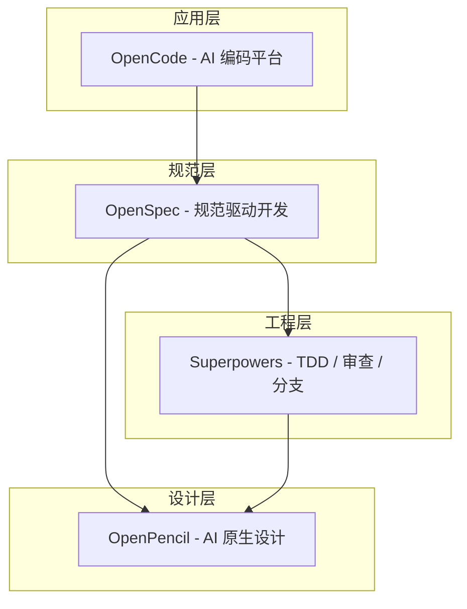
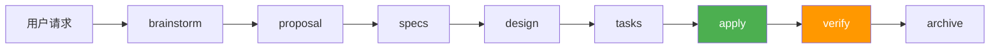
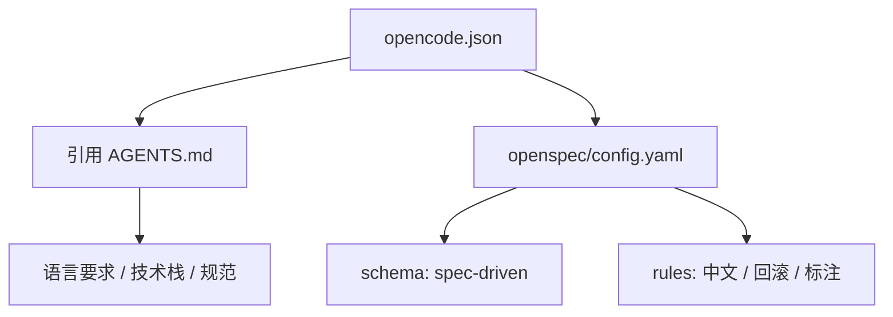
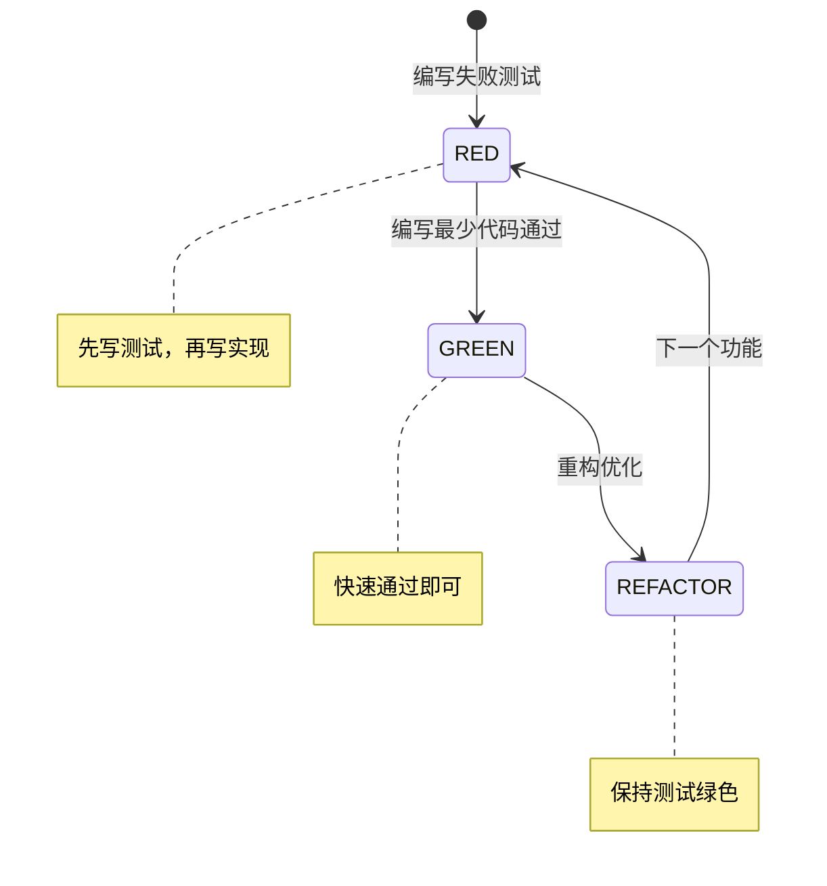
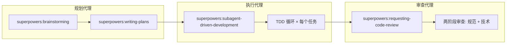
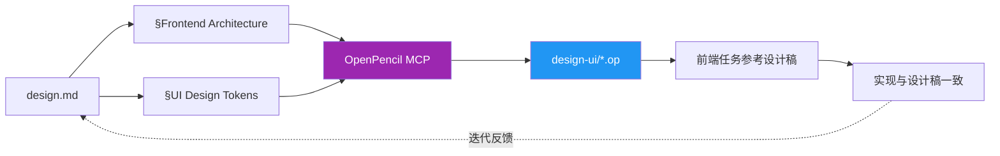
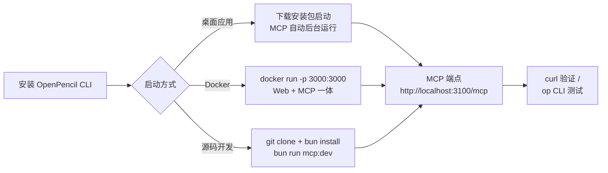
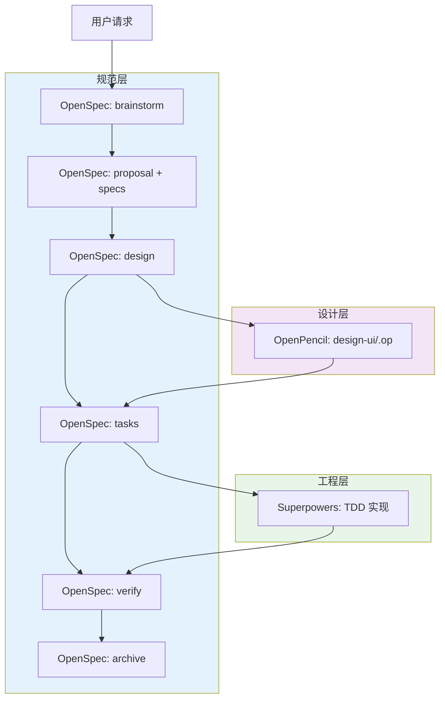
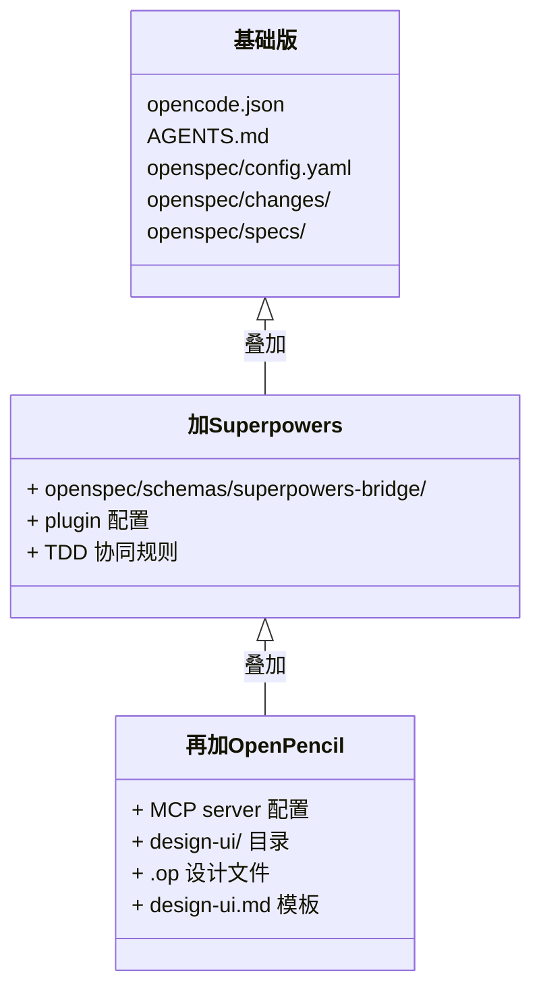
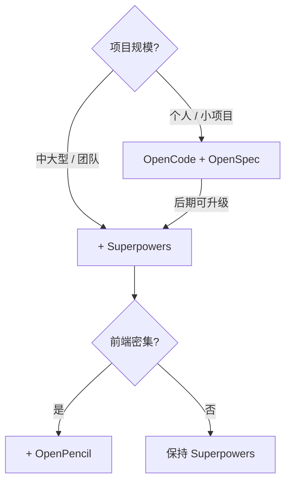

AI 编程助手已经能写出像样的代码，但你有没有遇到过这些问题：需求在聊天记录里，退出就找不回；每次让 AI 改同一个功能，结果都不一样；前端做出来总感觉"差那么点意思"；代码没有测试，合并时心惊胆战。

这些问题的根源在于：**AI 编程缺的不是能力，是流程**。

本文介绍三款工具的组合方案——OpenSpec（规范引擎）+ Superpowers（工程方法论）+ OpenPencil（AI 设计工具），在 OpenCode 平台之上构建从需求到设计到交付的完整工作流。你可以按需渐进集成，不必一次性全部上。



| 工具 | 定位 | 核心职责 |
|------|------|----------|
| OpenCode | AI 编码平台 | 执行环境，MCP 协议容器 |
| OpenSpec | 规范驱动开发 (SDD) | 变更管理、需求沉淀、可追溯 |
| Superpowers | 工程方法论 | TDD 循环、代码审查、分支隔离 |
| OpenPencil | AI 原生设计工具 | UI 设计稿生成、设计令牌管理 |

---

## 一、OpenSpec — 规范即代码

### 1.1 原理

OpenSpec 的核心思想很简单：**在写代码之前，先让 AI 和人达成共识**。这个"共识"不是聊天记录里的几句话，而是存放在项目中的结构化文档。

它把一次变更组织成五个阶段：



每个阶段对应一个文档（Artifact）：

| 文档 | 回答的问题 | 内容 |
|------|-----------|------|
| brainstorm.md | 需求在什么场景下产生？ | 用户场景、问题分析 |
| proposal.md | 为什么要做？要做到什么程度？ | 意图、范围、影响 |
| specs/ | 具体要做什么？ | 功能规格、验收标准 |
| design.md | 怎么做？ | 架构方案、技术选型 |
| tasks.md | 按什么步骤做？ | 任务拆解、前后端分组 |

你通过斜杠命令操作这些文档：

| 命令 | 作用 |
|------|------|
| `/opsx:new xxx` | 创建变更 |
| `/opsx:ff` | 快速生成所有文档 |
| `/opsx:apply` | 执行实现 |
| `/opsx:verify` | 验证一致性 |
| `/opsx:archive` | 归档 |

传统 prompt 工程是"一次性聊天"，OpenSpec 则是**可追溯的变更管理**。每次修改都经过规范化流程，需求和决策被结构化的记录下来，不再丢失在聊天记录里。

### 1.2 配置教程

**第一步：环境准备**

```bash
node --version    # 需 >= 20.19.0
npm --version
```

**第二步：安装 OpenSpec**

```bash
npm install -g @fission-ai/openspec@latest
openspec --version
```

**第三步：初始化项目**

```bash
cd your-project
openspec init
openspec config profile
# 选择：Expanded Profile（完整命令支持）
openspec update
```

**第四步：配置三个核心文件**

`opencode.json` — 接通 OpenCode 平台：

```json
{
  "$schema": "https://opencode.ai/config.json",
  "instructions": [
    "AGENTS.md",
    "doc/"
  ],
  "permission": {
    "skill": {
      "*": "allow"
    }
  },
  "agent": {
    "plan": {
      "permission": {
        "skill": {
          "*": "allow"
        }
      }
    }
  }
}
```

`AGENTS.md` — 项目指令文件：

```markdown
# 项目指南

## 语言要求
- 所有输出请用中文

## 技术栈
Spring Boot 3.3.0 + MyBatis-Plus + JDK 17 + MySQL + Redis（替换为你的技术栈）

## OpenSpec 工作流
| 命令 | 说明 |
|------|------|
| /opsx:new | 创建变更 |
| /opsx:ff | 快速生成所有文档 |
| /opsx:apply | 执行实现 |
| /opsx:verify | 验证一致性 |
| /opsx:archive | 归档 |

## 开发规范
- 使用 Given/When/Then 格式描述测试场景
- 变更必须包含回滚方案
- 标注影响的模块和数据库表
```

`openspec/config.yaml` — Schema 选择和上下文注入：

```yaml
schema: spec-driven

context: |
  项目：你的项目名称
  输出语言：中文
  技术栈：Spring Boot + MySQL
  业务模块：用户管理、订单系统

rules:
  proposal:
    - 必须使用中文输出
    - 必须包含回滚方案
    - 标注影响的模块范围
  specs:
    - 使用中文描述测试场景
    - 标注涉及的表和 API
```



配置完成后，执行 `/opsx:new 你的任务` 即开始规范驱动开发。

---

## 二、Superpowers — 给 AI 装上工程纪律

### 2.1 原理

如果说 OpenSpec 解决了"需求结构化"的问题，Superpowers 解决的是"执行质量"的问题。

AI 生成的代码看起来不错，但你可能不敢直接上线——因为没有测试，没有审查，没有分支策略。

Superpowers 通过一套工程技能系统解决了这些问题：



这是经典的 TDD 循环——但由 AI 自动执行。

Superpowers 采用 **三代理架构** 来完成一次变更：



| 技能 | 职责 |
|------|------|
| brainstorming | 需求探索，澄清模糊地带 |
| writing-plans | 将任务拆解为微步骤 |
| subagent-driven-development | 子代理分工，并行开发 |
| using-git-worktrees | 变更在独立 worktree 中隔离 |
| requesting-code-review | 两阶段代码审查 |

**superpowers-bridge schema** 是连接 OpenSpec 和 Superpowers 的桥梁。它把 OpenSpec 的规范文档生命周期（proposal → specs → design → tasks）和 Superpowers 的执行技能（TDD → 审查 → 分支）对接起来。

### 2.2 配置教程

**第一步：更新 opencode.json 添加插件**

```json
{
  "$schema": "https://opencode.ai/config.json",
  "plugin": [
    "superpowers@git+https://github.com/obra/superpowers.git"
  ],
  "instructions": [
    "AGENTS.md",
    "doc/"
  ],
  "permission": {
    "skill": {
      "*": "allow"
    }
  },
  "agent": {
    "plan": {
      "permission": {
        "skill": {
          "*": "allow"
        }
      }
    }
  }
}
```

**第二步：下载 superpowers-bridge schema**

```bash
git clone https://github.com/JiangWay/openspec-schemas.git /tmp/openspec-schemas
cp -r /tmp/openspec-schemas/superpowers-bridge openspec/schemas/
```

**第三步：更新 AGENTS.md 添加协同规则**

```markdown
## OpenSpec + Superpowers 协同规则

### 规划阶段
- 创建变更时指定 schema：`/opsx:new 任务名 --schema superpowers-bridge`
- 自动调用 `superpowers:brainstorming`

### 实现阶段
- `/opsx:apply` 自动调用 `superpowers:subagent-driven-development`
- 每个任务强制 TDD：RED → GREEN → REFACTOR
- 代码审查：两阶段 subagent 审查

### 验证阶段
- 5 项检查：结构验证、任务完成、Delta Spec 同步、设计/规格一致性、实现信号
```

**第四步：验证配置**

```bash
# 重启 OpenCode 使插件生效
# 检查 schema 是否可用
ls openspec/schemas/superpowers-bridge/

# 创建测试变更验证
/opsx:new 测试集成 --schema superpowers-bridge
```

如果一切正常，执行 `/opsx:apply` 时会看到 AI 自动进入 TDD 循环：先写测试 → 再写实现 → 重构 → 代码审查。

---

## 三、OpenPencil — AI 也能出设计稿

### 3.1 原理

AI 编程最尴尬的是什么？前端做出来了，但界面"差那么点意思"。

这不是 AI 写不出 CSS，而是**没有设计稿**。AI 对界面样式的决策完全是随机的——这次给你圆角，下次给你直角，全凭 token 概率。你只能在 prompt 里反复调整："再左一点、大一点、换个颜色"。

OpenPencil 是一个 AI 原生的矢量设计工具，它的 .op 文件可以被 AI 直接读写。这意味着 AI 可以帮你**自动生成设计稿**，前端开发时拿着设计稿做，告别"盲写 CSS"。

设计闭环的工作流是这样的：



关键管道是 **MCP 协议**。OpenPencil 通过 MCP 暴露多个工具：

| MCP 工具 | 功能 |
|----------|------|
| `batch_design` | 批量设计 DSL，一行一个操作 |
| `design_skeleton` | 创建页面骨架（分层工作流第一步） |
| `design_content` | 填充内容节点（分层工作流第二步） |
| `design_refine` | 全树验证和自动修正 |
| `insert_node` | 插入新节点 |
| `update_node` | 更新已有节点属性 |
| `export_code` | 导出为 React / Vue / HTML 等代码 |

**design.md** 是设计入口。它包含 `§Frontend Architecture` 和 `§UI Design Tokens` 两个章节，定义了配色方案、组件规范、布局结构。OpenPencil 从这里提取信息，自动生成对应每个 capability 的 .op 设计文件。

### 3.2 配置教程

**第一步：安装 OpenPencil CLI**

```bash
npm install -g @zseven-w/openpencil
op --version
```

**第二步：启动 OpenPencil（两种方式）**

方式一：启动桌面应用（推荐）

从 [GitHub Releases](https://github.com/ZSeven-W/openpencil/releases) 下载对应系统的安装包（macOS / Windows / Linux），安装并打开。桌面应用启动后自动在后台运行 MCP 服务器，无需额外配置。

```bash
# 也可以通过 CLI 启动桌面应用
op start
```

方式二：Docker 运行 Web 模式

```bash
docker run -d -p 3000:3000 ghcr.io/zseven-w/openpencil:latest
```

Web 应用运行在 `http://localhost:3000`，同样内嵌 MCP 服务器。

OpenPencil 提供了多种 Docker 镜像变体：

| 镜像 | 说明 |
|------|------|
| `openpencil:latest` | Web 应用仅 (~226 MB) |
| `openpencil-opencode:latest` | Web + OpenCode CLI |
| `openpencil-full:latest` | 所有 CLI 工具 (~1 GB) |



**第三步：验证 MCP 服务可用**

```bash
# 测试 MCP HTTP 端点是否响应
curl http://localhost:3100/mcp

# 通过 CLI 确认连接
op --version
```

**第四步：更新 opencode.json 添加 MCP 服务器**

```json
{
  "$schema": "https://opencode.ai/config.json",
  "plugin": [
    "superpowers@git+https://github.com/obra/superpowers.git"
  ],
  "mcp": {
    "openpencil": {
      "type": "remote",
      "url": "http://127.0.0.1:3100/mcp"
    }
  },
  "instructions": [
    "AGENTS.md",
    "doc/"
  ],
  "permission": {
    "skill": {
      "*": "allow"
    }
  },
  "agent": {
    "plan": {
      "permission": {
        "skill": {
          "*": "allow"
        }
      }
    }
  }
}
```

**第五步：扩展 schema 添加 design-ui artifact**

在 `openspec/schemas/superpowers-bridge/schema.yaml` 中添加：

```yaml
- id: design-ui
  generates: design-ui/
  description: UI 设计稿（OpenPencil 格式），从 design.md 前端章节生成
  template: design-ui.md
  instruction: |
    使用 OpenPencil 生成 UI 设计稿。
    从 design.md 的 §Frontend Architecture 和 §UI Design Tokens 提取信息。
    为 specs/ 中的每个 capability 生成对应的 .op 设计文件。
    使用 MCP 工具或 op CLI 创建设计。
    输出目录：design-ui/<capability-name>.op
  requires:
    - design
```

**第六步：创建设计稿模板**

在 `openspec/schemas/superpowers-bridge/templates/design-ui.md`：

```markdown
# UI 设计稿

## 概述
本目录包含变更相关的 UI 设计稿，使用 OpenPencil 格式（.op 文件）。

## 关联 Capabilities
| Capability | 设计文件 | 说明 |
|------------|----------|------|
| {name} | {name}.op | {description} |

## 设计规范
从 design.md 提取的样式要求：
- 主色：{primary-color}
- 辅助色：{secondary-color}
- 背景色：{background-color}

## 组件清单
- Header：顶部导航栏
- Content：主内容区域
- Footer：底部信息区

## 使用说明
1. 使用 OpenPencil 打开 .op 文件
2. 参考设计稿进行代码实现
3. 可导出为 PNG 或代码（React/Vue）
```

**第七步：更新 AGENTS.md 添加协同规则**

```markdown
## OpenPencil 协同规则

### 集成阶段
- **specs 阶段**：定义功能需求，含前后端 Requirement 分类
- **design 阶段**：在 §Frontend Architecture 和 §UI Design Tokens 确定前端架构
- **design-ui 阶段**：从 design.md 提取信息，生成 .op 文件
- **tasks 阶段**：前端任务引用 .op 设计稿

### 设计文件位置
`openspec/changes/<change-name>/design-ui/`

### MCP 工具
- `openpencil_design`：生成 UI 设计
- `openpencil_export`：导出设计稿
```

---

## 四、三个工具如何协同 — 完整工作流

把三者组合起来，一次变更的完整端到端流程如下：



用命令来走一遍更直观：

```bash
# 1. 创建变更
/opsx:new 实现用户登录 --schema superpowers-bridge

# 2. 自动触发 brainstorming，生成需求文档
/opsx:ff
# 生成：brainstorm.md → proposal.md → specs/ → design.md → design-ui/ → tasks.md

# 3. 执行（TDD 自动开启）
/opsx:apply
# - 创建 git worktree 隔离
# - 每个任务先写测试（RED）
# - 再写实现（GREEN）
# - 重构优化（REFACTOR）
# - 两阶段代码审查

# 4. 验证
/opsx:verify

# 5. 归档
/opsx:archive
```

你什么都不用做，只需要提需求、审结果。AI 自动走完规范→设计→TDD→审查的全流程。

目录结构随着集成阶段逐步丰富：



---

## 五、选型建议

不是所有项目都需要全套工具。根据你的场景按需选择：



| 场景 | 推荐组合 | 核心价值 |
|------|----------|----------|
| 个人项目 / 快速原型 | OpenCode + OpenSpec | 变更可追溯、需求不漏 |
| 中大型项目 / 团队协作 | + Superpowers | TDD 保障质量、代码审查把关 |
| 前端密集型项目 | + OpenPencil | 设计稿闭环、告别盲写 CSS |

**渐进式集成的建议**：从小处着手，先跑通 OpenSpec，感受规范驱动开发的价值；再叠加 Superpowers 提升工程质量；最后在需要时加入 OpenPencil 补齐设计环节。一次性全上学习成本高，分步实践更可持续。

---

## 六、总结

三个工具回答三个核心问题：

1. **OpenSpec** — 这件事有规范吗？需求是可追溯的吗？
2. **Superpowers** — 这件事有测试吗？代码经过审查了吗？
3. **OpenPencil** — 这件事有设计稿吗？前端有参考基准了吗？

从"AI 写代码"到"AI 规范地交付"，关键在于**给 AI 装上流程**。工具链本身是灵活的——你不需要一步到位，拿到哪一层都能提升效率，叠加越多效果越显著。

---

## 附录：仓库地址

| 工具 | 仓库地址 |
|------|----------|
| OpenCode | https://github.com/anomalyco/opencode |
| OpenSpec | https://github.com/fission-ai/openspec |
| Superpowers | https://github.com/obra/superpowers |
| superpowers-bridge schema | https://github.com/JiangWay/openspec-schemas/tree/main/superpowers-bridge |
| OpenPencil | https://github.com/ZSeven-W/openpencil |
| OpenPencil Skill | https://github.com/ZSeven-W/openpencil-skill |
| OpenPencil 官网 | https://op.zseven.tech |
| OpenSpec 官方文档 | https://opencode.ai/docs |
| OpenSpec 社区 schemas | https://github.com/Fission-AI/OpenSpec/blob/main/docs/customization.md |
