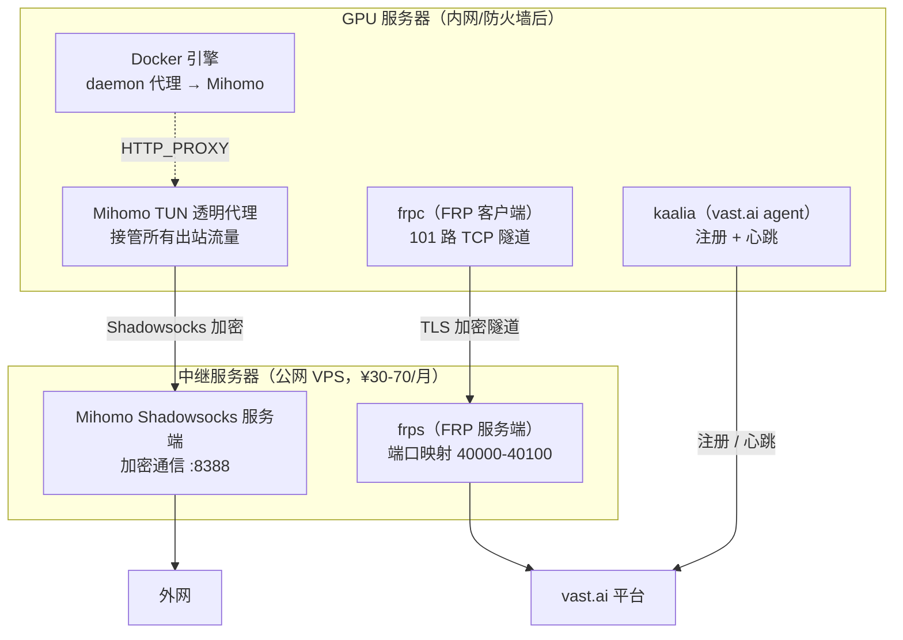
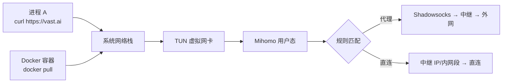
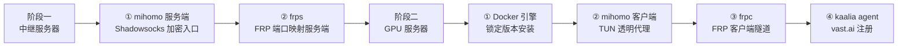

2026 年 5 月，Blackwell GPU 的租赁价格两个月涨了 48%，H100 合约价半年涨了 40%。全球 AI 公司基础设施支出超过 **6000 亿美元**，NVIDIA 削减了 40% 的游戏卡产能来供应数据中心——高端 GPU 交付周期已排到 **2027 年**。

算力租赁市场正在经历一场供需失衡的历史级行情。中国信通院数据显示，2026 年 Q1 国内算力租赁市场规模达 **680 亿元**，同比增长 62%。

而你可能有一张 RTX 4090，每天跑 4-6 小时训练任务，剩下 18 小时在空转。电费照付，折旧照算，一分钱没收回来。

**一张 RTX 4090，在 vast.ai 上出租，扣除电费和平台抽成后，每月净收入约 ¥350-600**。如果你有 4 张卡，就是 ¥1400-2400/月。

但有个现实问题：国内的 GPU 服务器连不上 vast.ai。出站被墙，入站没公网 IP。

本文提供一套 **已验证的方案**：通过一台 ¥30/月的公网 VPS 做中继，用 FRP 建立端口隧道 + Mihomo TUN 透明代理，让内网 GPU 服务器正常注册到 vast.ai 并开始出租。两条命令，30 分钟部署。

---

## 一、这生意划不划算？先算经济账

在动手之前，先搞清楚能赚多少。这不是空口估算——以下是 2026 年 5 月 vast.ai 平台上消费级 GPU 的实际市场数据：

| GPU 型号 | 显存 | 市场时薪 | 月总收入¹ | 月电费² | 折旧³ | 平台费(20%) | **月净利润** |
|----------|------|---------|----------|--------|-------|-----------|------------|
| RTX 3060 | 12 GB | $0.06-0.10 | ~¥200 | ~¥100 | ~¥80 | ~¥40 | **~-¥20** |
| RTX 3080 | 10 GB | $0.10-0.15 | ~¥380 | ~¥130 | ~¥120 | ~¥76 | **~¥54** |
| RTX 3090 | 24 GB | $0.20-0.35 | ~¥780 | ~¥180 | ~¥150 | ~¥156 | **~¥294** |
| **RTX 4090** | 24 GB | **$0.25-0.50** | **~¥1050** | **~¥190** | **~¥270** | **~¥210** | **~¥380** |
| RTX 5090 | 32 GB | $0.40-0.70 | ~¥1520 | ~¥220 | ~¥380 | ~¥304 | **~¥616** |

> ¹ 按 55% 利用率（消费级卡稳态）、30 天、¥7.2/$ 汇率估算  
> ² 电费按 ¥0.8/kWh，含系统功耗（CPU + 主板 + 风扇约 150W）  
> ³ 折旧按 3 年线性分摊

**电费是最大变量**。不同的电价，净利润差很大：

| 电价 | ¥0.4/kWh | ¥0.6/kWh | ¥0.8/kWh | ¥1.0/kWh |
|------|-----------|-----------|-----------|-----------|
| RTX 4090 月净利 | ~¥530 | ~¥450 | ~¥380 | ~¥300 |
| 回本周期 | ~8 个月 | ~10 个月 | ~12 个月 | ~15 个月 |

**关键结论**：

- **RTX 3080 以下不值得折腾**——勉强覆盖电费
- **RTX 4090 是甜点卡**——费率够高、折旧可控
- **电费超过 ¥1.0/kWh，利润大幅缩水**——注意你的机房电费
- **第一月收益是稳态的 30-40%**——新 Host 需要积累信誉分，别被首月数据劝退

成本方面，你需要一台 **中继 VPS**（有公网 IP，¥30-70/月，搬瓦工或其他便宜 VPS 即可），这是唯一的额外投入，首月利润就能回本。

---

## 二、为什么你的 GPU 连不上 vast.ai？

国内 GPU 服务器注册 vast.ai 要过两道关：

```
你的 GPU 服务器 → [出站：被墙] → vast.ai API
vast.ai 租户   → [入站：无公网 IP] → 你的 GPU
```

**出站问题**：vast.ai 的 agent 需要访问外网 API 进行注册、心跳、拉取容器镜像等操作。国内服务器直接访问会被阻断。

**入站问题**：vast.ai 的计费模型是：租户通过 SSH 连接到你的 GPU 服务器上的容器。如果服务器没有公网 IP，租户连不进来，平台就不会让你上线。

以下是几种常见方案的对比：

| 方案 | 出站 | 入站 | 稳定性 | 成本 | 维护 |
|------|------|------|--------|------|------|
| VPN/WireGuard | ✅ | ❌ 需额外配置 | ⚠️ IP 易被封 | 低 | 高 |
| 机场代理 + FRP | ⚠️ 机场不稳 | ✅ FRP | ❌ 机场延迟波动 | 中 | 中 |
| **本方案：SS+TUN+FRP** | ✅ SS 加密 | ✅ FRP TLS | ✅ 自建节点可控 | 低 | **低** |
| 直接买公网 IP | ✅ | ✅ | ✅ | 极高 | 低 |

**本方案的优势**：出站用 Shadowsocks 加密（无特征，不会被 DPI 识别），入站用 FRP 端口隧道（TLS 加密，容器级粒度），全部自建 systemd 服务管理，断线自动重连。

---

## 三、整体架构



**两条链路，各司其职**：

| 链路 | 方向 | 技术 | 职责 |
|------|------|------|------|
| **出站** | GPU → 外网 | Shadowsocks + TUN 透明代理 | agent 注册、心跳、docker pull |
| **入站** | 外网 → GPU | FRP 端口隧道 | 租户 SSH 连接容器 |

互不依赖，任意一条链路出问题不影响另一条。

---

## 四、核心技术拆解

### 4.1 FRP 隧道——内网没公网 IP 怎么暴露端口？

**一句话原理**：frpc（客户端）主动连接 frps（服务端），建立一条长连接 TCP 隧道。外部请求到达 frps 后，通过这条隧道转发到内网。

```
外网请求 → frps(公网:40000) → [TLS 隧道] → frpc(内网) → localhost:40000
```

frpc 是**主动方**，所以内网机器不需要公网 IP 也能暴露端口。

**为什么选 FRP 而不是 WireGuard？**  
WireGuard 是三层 VPN，虚拟网卡会暴露 GPU 服务器的整个网络，安全风险高。FRP 是四层端口代理，粒度精确到单个端口。vast.ai 的模型是**每个租户一个独立端口**（40000-40100），FRP 天然匹配。而且 FRP 的 TLS 加密不影响租户的 SSH 密钥认证流程。

### 4.2 Shadowsocks——出站流量不被识别为代理

**一句话原理**：数据用 AEAD 算法（aes-256-gcm）加密后发送，外形和随机数据无异，不会被 DPI 设备识别为代理流量。

| 层 | 组件 |
|----|------|
| 应用层 | 用户数据（HTTP/HTTPS/任意） |
| 加密层 | AEAD，每个包独立 IV，无协议特征 |
| 传输层 | TCP/UDP，Shadowsocks 协议封装 |

**为什么选 SS 不选 V2Ray？**  
V2Ray 功能多但配置复杂。SS 服务端只需一个 `listeners` 块，一行 `password` 一行 `cipher`，维护成本最低。在这个场景里，GPU 只做一件事——出站访问，SS 足够且最稳定。

### 4.3 TUN 透明代理——Docker 容器也走代理

**一句话原理**：Mihomo 在系统创建一个 TUN 虚拟网卡，所有 IP 层流量（无论来自哪个进程、哪个 Docker 容器）都被送入这个虚拟网卡，由 Mihomo 做代理决策。



三种代理方式的覆盖范围对比：

| 方式 | 覆盖范围 | 局限 |
|------|---------|------|
| HTTP_PROXY 环境变量 | 单个进程 | Docker 容器不继承宿主变量 |
| SOCKS5 代理 | 支持 SOCKS 的进程 | 很多命令行工具不支持 |
| **TUN 透明代理** | **整个系统所有流量** | Docker 容器自动走代理 |

在 TUN 模式下，无论是 `kaalia agent` 的注册请求，还是 `docker pull` 的镜像拉取，都自动走代理——不需要为每个组件单独配置代理地址。

### 4.4 Docker daemon 代理——镜像拉取的最后一公里

虽然 TUN 已经能接管 Docker 容器流量，但 Docker daemon 本身的网络行为（拉取镜像）走的是宿主机网络栈，不经过 TUN。因此需要额外配置：

```
# systemd drop-in: /etc/systemd/system/docker.service.d/proxy.conf
[Service]
Environment="HTTP_PROXY=http://127.0.0.1:7892/"
Environment="HTTPS_PROXY=http://127.0.0.1:7892/"
Environment="NO_PROXY=localhost,127.0.0.1,<中继IP>,10.0.0.0/8,..."
```

Host 模式，而是作为系统 systemd 服务的环境变量注入。这决定了安装顺序**必须先装 Docker，再配置代理，再重启 daemon**。

---

上面这些原理不需要你全部理解才能用。但理解了，遇到问题就有方向——比如 frpc 连不上，你知道去查 TLS 握手；TUN 起不来，你知道去排查端口 53 是否被占用。

## 五、部署实战

部署脚本全部开源，只需编辑一个 `config.env`，然后两条命令。

### 5.1 先决条件

| 条件 | 说明 |
|------|------|
| GPU 服务器 | x86_64 Linux，NVIDIA GPU，8 GB+ 显存（RTX 3060 或更新） |
| 中继 VPS | 公网 IP，1C1G 足够，¥30-70/月 |
| 操作系统 | Ubuntu/Debian/CentOS/RHEL/Rocky/AlmaLinux/Fedora/Alibaba Cloud Linux |
| 权限 | 两台机器都需要 root |
| 防火墙 | 中继需开放 7000（FRP）、8388（SS）、40000-40100（端口池） |

### 5.2 配置

项目目录结构：

```
vastai-host-setup/
├── config.env              全局配置（两台机器共用）
├── utils.sh                公共函数库（日志/校验/安装）
├── setup-server.sh         中继服务器部署脚本
├── setup-client.sh         GPU 服务器部署脚本
└── vast_host_installer.py  vast.ai 官方安装器
```

编辑 `config.env`，填入你的配置：

```bash
# 中继服务器公网 IP（必填）
TUNNEL_SERVER_IP="<你的中继IP>"

# FRP 隧道认证令牌（必填，自行生成）
TUNNEL_TOKEN="openssl rand -hex 32 生成的随机字符串"

# Shadowsocks 密码（必填，自行生成）
MIHOMO_PASSWORD="openssl rand -base64 32 生成的随机密码"

# vast.ai API Token（必填，从 https://console.vast.ai 获取）
VAST_TOKEN="<你的vast.ai token>"

# === 以下保持默认即可 ===
FRP_BIND_PORT=7000
PORT_RANGE_START=40000
PORT_RANGE_END=40100
MIHOMO_SERVER_PORT=8388
MIHOMO_METHOD="aes-256-gcm"
MIHOMO_TUN_STACK="gvisor"
DOCKER_VERSION="28.0.4"
FRP_VERSION="0.68.1"
AGENT_NO_DRIVER=true             # 跳过 NVIDIA 驱动安装（不用重复装）
```

### 5.3 部署顺序

> **必须先部署中继服务器，再部署 GPU 服务器。**



#### 阶段一：中继服务器

```bash
ssh root@<中继IP>
bash setup-server.sh all
```

这条命令会完成：

1. 安装 Mihomo，配置 Shadowsocks 服务端（监听 :8388）
2. 启用 IP 转发
3. 安装 frps，配置 TLS 加密的端口映射（:7000，端口池 40000-40100）
4. 注册 systemd 服务，设为开机自启

**中继服务器防火墙需放行**：

| 端口 | 用途 | 说明 |
|------|------|------|
| 7000 | FRP 绑定端口 | GPU 服务器会连接 |
| 8388 | Shdowsocks 服务端 | GPU 服务器的代理出口 |
| 40000-40100 | FRP 端口池 | vast.ai 租户连接容器 |

#### 阶段二：GPU 服务器

```bash
# SSH 进 GPU 服务器，建议用 tmux/screen 执行（TUN 启用后网络重建可能断连）
ssh root@<GPU服务器>
bash setup-client.sh all
```

这条命令按顺序执行：`docker → mihomo → frpc → agent`。

**各步骤的关键配置**：

Mihomo TUN 客户端配置（`/etc/mihomo/config.yaml`）：

```yaml
mixed-port: 7892
mode: rule

tun:
  enable: true
  stack: gvisor          # 用户态 TCP/IP 栈，不受防火墙影响
  dns-hijack:
    - any:53             # 劫持 DNS，防污染
  auto-route: true

dns:
  enable: true
  listen: 0.0.0.0:53
  nameserver:
    - https://doh.pub/dns-query      # 国内 DoH
    - https://dns.alidns.com/dns-query

proxies:
  - name: relay
    type: ss
    server: "<中继IP>"
    port: 8388
    password: "<MIHOMO_PASSWORD>"
    cipher: aes-256-gcm

rules:
  - IP-CIDR,<中继IP>/32,DIRECT       # 中继直连
  - IP-CIDR,10.0.0.0/8,DIRECT       # 内网直连
  - IP-CIDR,192.168.0.0/16,DIRECT
  - MATCH,PROXY                      # 其余走代理
```

部署完成后，验证代理连通：

```bash
# TUN 模式下所有流量自动代理，直接用 curl 测试
curl -I https://google.com

# 也可通过混合端口单独测试
export http_proxy=http://127.0.0.1:7892
curl -I https://google.com
```

然后登录 [cloud.vast.ai](https://cloud.vast.ai) → 切换到 Host 账号 → 确认机器出现在 Machines 列表中。

### 5.4 幂等——跑错了？再跑一次

所有操作设计为**可重复执行**，不会破坏已有系统：

| 组件 | 幂等方式 |
|------|---------|
| Docker | 检测版本匹配则跳过安装 |
| 二进制（Mihomo/FRP） | 检测版本匹配则跳过下载 |
| systemd 服务 | 服务 active 且配置无变化则跳过 |
| 配置文件 | `diff` 检测内容无变化则不写 |
| kaalia agent | 服务 active 则跳过重装 |

核心脚本逻辑：

```bash
safe_write_file() {
    local file=$1 content=$2
    if config_changed "$file" "$content"; then
        # 有变化才写，写前先备份
        cp "$file" "${file}.bak.$(date +%s)"
        echo "$content" > "$file"
    else
        log_info "配置无变化，跳过"
    fi
}
```

这意味着如果机器掉线、系统重启、配置文件损坏，重新跑一遍脚本即可恢复，**不影响正在运行的出租任务**。

---

## 六、上线运营——怎样让机器租出去

部署上线只是第一步。以下是从实操中总结的运营要点。

### 6.1 创建 Offer

登录 vast.ai Host 控制台：

1. 确认 GPU 出现在 Machines 列表
2. 点击 Create Offer → 选择 Verification Level
3. **建议从 Intermittent 起步**——审核门槛低，上线快
4. 机器稳定后可以升级到 Verified（更高优先级）

### 6.2 定价策略

vast.ai 是纯市场定价，Host 自己设时薪：

| 策略 | 做法 | 适合场景 |
|------|------|---------|
| **渗透定价** | 设市场最低价起步 | 新 Host，快速积累信誉和评分 |
| **跟随定价** | 设略低于同类卡均价 | 有评分后，平衡收益和利用率 |
| **溢价定价** | 比均价高 10-20% | 高评分 + 低延迟 + 高带宽 |

查看同型号卡的当前市场价：https://vast.ai/pricing

**建议**：第一个月设低于均价 10-15%，快速拉高评分和运行时长。vast.ai 的搜索排名算法会优先展示评分高、在线率高的 Host。

### 6.3 Self-test——自己先租一次

用另一个 vast.ai 账号（租户视角）搜索并租用自己的机器：

- SSH 连通性
- CUDA 可用性（`nvidia-smi`）
- 下载速度（`wget` 一个大文件测试带宽）
- PyTorch 推理跑通

这一步很重要——很多租户租到机器后发现 SSH 慢、带宽低，直接差评走人。一个差评需要 10 个好评才能冲回来。

### 6.4 运营建议

| 事项 | 建议 |
|------|------|
| 最低租用时 | 设置 1 小时起租，避免频繁切租户 |
| 驱动版本 | 保持 CUDA 12.x+，PyTorch 租户最多 |
| 在线率监控 | crontab 定时 `curl -I https://vast.ai`，掉线自动重跑脚本 |
| 月初定价 | 月初需求旺，可适当提价 |
| 竞争监控 | 定期查看同型号卡价格，保持竞争力 |

---

## 七、FAQ

### Q1：一张卡能稳定赚多少？

取决于利用率和电费。RTX 4090 稳态月净利约 ¥350-600。首月偏低（30-40%），3 个月后进入稳态。

### Q2：中继服务器需要什么配置？

1C1G 足够，带宽建议 100Mbps+。搬瓦工或同类便宜 VPS 即可，¥30-70/月。一台中继可带 1-2 台 GPU 服务器。

### Q3：TUN 透明代理会不会影响我正常使用？

TUN 接管所有流量，但**不会降低国内访问速度**——中继 IP 和所有内网段都配了直连规则，只有出站流量才走代理。

### Q4：机器掉线了怎么办？

SSH 连进去，重新跑 `bash setup-client.sh all`。脚本幂等，不影响已经跑着的任务。

### Q5：vast.ai 怎么提现？

支持加密货币（Coinbase、Crypto.com）和银行转账。最低 $5 起提，无手续费。

### Q6：国内电费这么高，还值得吗？

按 ¥0.8/kWh 算，RTX 4090 月净利 ~¥380。减去中继 VPS ¥50，净剩 ~¥330。一年约 ¥4000，大约覆盖卡价的 25%。如果卡已经在手用来跑自己的训练，那出租空余时间就是纯增量收入。

---

## 八、局限与建议

这套方案不是银弹，有几点需要考虑：

**中继带宽是瓶颈**  
frps 的出口带宽直接影响租户的 SSH 体验和下载速度。建议单台中继匹配 1-2 台 GPU 服务器，避免链路拥塞。

**电费敏感度很高**  
如果机房电费超过 ¥1.0/kWh，消费级显卡的出租利润会被严重压缩。建议先用电表和你的实际电价算清楚再动手。

**首月要有耐心**  
vast.ai 的新 Host 需要时间积累信誉分，第一个月的利用率和价格都不太理想。坚持 3 个月，数据会逐渐改善。

**规模扩大的上限**  
如果手上有 4 卡以上，建议考虑升级中继配置，或者采用多中继 + 负载均衡的架构。

---

2026 年的 GPU 租赁市场正在经历供不应求的黄金期。高端卡交付周期排到 2027 年，AI 公司的算力需求看不到天花板。对于手上有闲置 GPU 的人来说，这是一个低门槛、高确定性的增量收入来源。

你的 GPU 每天工作几小时？剩下的时间，它本可以为你赚钱。

或者换个问法——你买的，到底是显卡，还是一台**印钞机**？

---

**附录：部署脚本与资源**

| 资源 | 地址 |
|------|------|
| 部署脚本 | 项目仓库（详见 README） |
| vast.ai Host Console | https://cloud.vast.ai |
| 实时 GPU 定价 | https://vast.ai/pricing |
| FRP 项目 | https://github.com/fatedier/frp |
| Mihomo 项目 | https://github.com/MetaCubeX/mihomo |
