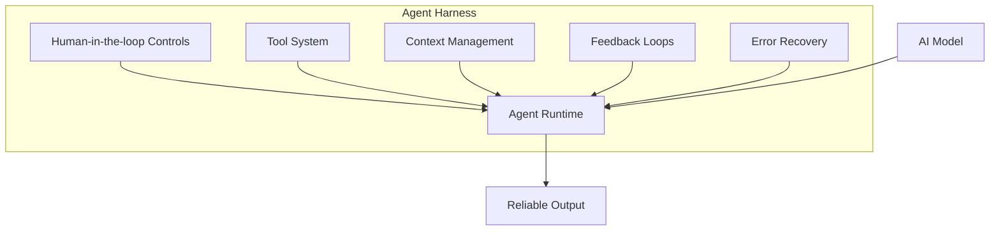
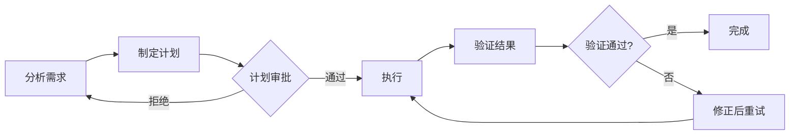

# Harness Engineering：AI Agent 时代的工程化实践

2025 年，整个行业都在讨论 AI Agent——它们能做什么、如何构建、怎样部署。到了 2026 年，一个更加根本性的问题浮出水面：**如何让 Agent 可靠地工作？**

正如 SaaS 领域投资人 Aakash Gupta 所言：「2025 年是 Agent 之年，2026 年是 Harness 之年。模型是商品，Harness 才是护城河。」这一观点在行业内引发了广泛共鸣。Manus 重写 Harness 五次历时六个月，LangChain 一年迭代四次架构，OpenAI 甚至用 Agent 构建了完整的生产系统——这些实践都在验证同一个核心命题：**当模型能力趋同时，决定 Agent 质量的关键因素转向了 Harness（套索/马具）**。

## 一、概念起源与定义

### 1.1 术语演进

Harness Engineering 作为一个正式概念，其演进历程折射出行业对 AI Agent 认知的深化：

| 时间 | 事件 | 核心贡献 |
|------|------|---------|
| 2025年12月 | Andrej Karpathy 提出 Context Engineering | 将 AI 上下文管理理论化 |
| 2026年2月初 | Mitchell Hashimoto 首创 Harness Engineering 术语 | 将约束设计系统化 |
| 2026年2月11日 | OpenAI Ryan Lopopolo 正式定义 | 基于 Codex 生产实践 |
| 2026年4月2日 | Martin Fowler 发布实践指南 | 提出 Feedforward/Feedback 框架 |

### 1.2 核心定义

> **Harness Engineering**：设计环境、约束和反馈循环的学科，使 AI 编码代理能够大规模可靠地工作，将工程师从编写代码转变为设计代理编写代码的治理系统。

这一概念的核心洞察可以凝练为一个简洁的公式：

```
Agent = Model + Harness
```

**模型是引擎，Harness 是汽车。** 世界上最优秀的引擎如果没有方向盘、刹车和油门，无法抵达任何有意义的目的地。

### 1.3 与相关概念的区别

理解 Harness Engineering 需要将其置于更广泛的 AI 工程方法论语境中：

| 维度 | Prompt Engineering | Context Engineering | Harness Engineering |
|------|------------------|---------------------|---------------------|
| **范围** | 单次交互 | 单个上下文窗口 | 整个 Agent 系统 |
| **控制对象** | 指令措辞 | Token 选择、排序、压缩 | 工具编排、状态持久化、验证循环、错误恢复 |
| **失败模式** | 指令不清晰 | 上下文中信息错误/遗漏 | Agent 错误、无限循环、多会话漂移、不安全操作 |
| **时间边界** | 单轮对话 | 一个上下文窗口 | 多个上下文窗口；完整任务生命周期 |

## 二、为什么 Harness 是护城河？

### 2.1 模型趋同的必然

观察过去一年大语言模型的发展，一个清晰的趋势浮现：头部模型之间的能力差距正在缩小。Claude、GPT-4、Gemini 在大多数编码任务上表现相近，模型本身正在变成一种「商品」——可以快速获取、容易替换、边际成本持续下降。

这种背景下，**差异化竞争必然从模型层转向应用层**。谁能让 Agent 更可靠地完成复杂任务，谁就掌握了真正的竞争优势。

### 2.2 构建可靠 Harness 的难度

与模型训练不同，可靠的 Harness 需要大量工程时间的积累：

- **Manus 案例**：六个月完成五次架构重写
- **LangChain 案例**：一年四次架构迭代
- **OpenAI Codex 案例**：五个月构建内部生产系统

这些数字揭示了一个关键事实：**你可以用几周时间微调出一个有竞争力的模型，但构建生产级 Harness 需要数月甚至数年。**

### 2.3 Harness 的不可复制性

与开源模型不同，Harness 是组织特定的知识资产。它包含：

- 团队特有的工程规范
- 定制化的工具链集成
- 针对性的反馈循环设计
- 长期积累的边界案例处理

这些难以通过简单的配置复制，必须基于对业务场景的深刻理解逐步构建。

## 三、Harness 核心组件

从功能角度划分，一个完整的 Agent Harness 包含以下核心组件：



### 3.1 Human-in-the-loop Controls（人在环控制）

这是最关键的约束机制，确保 Agent 在关键决策点有人类监督：

- **审批触发器**：删除数据库、执行支付、发送邮件等敏感操作需要人工确认
- **分级审批**：根据风险级别设置不同的审批流程
- **紧急停止**：在异常情况下立即中断 Agent 执行

### 3.2 Tool & Environment Management（工具与环境管理）

Agent 与外部世界交互的接口设计：

- **文件系统访问**：受控的文件读写权限
- **API 调用封装**：标准化的外部服务集成
- **代码执行环境**：沙箱化的测试和构建环境

### 3.3 Context Engineering（上下文工程）

管理 Agent 的「记忆」和知识获取：

- **RAG 知识检索**：动态获取相关文档
- **长期记忆管理**：跨会话的状态保持
- **上下文压缩**：避免上下文膨胀

### 3.4 Feedback & Reliability（反馈与可靠性）

确保输出质量的验证机制：

- **错误检测与恢复**：自动识别并修正错误
- **质量验证**：AI Judge 评估输出质量
- **监控与日志**：持续追踪 Agent 行为

## 四、Harness 分类框架

Martin Fowler 在其 2026 年 4 月的文章中提出了一个实用的分类框架，将 Harness 划分为三种类型：

### 4.1 Maintainability Harness（可维护性约束）

关注代码质量和内部属性：

- **Lint 规则**：代码风格强制
- **架构检查**：循环依赖检测
- **复杂度限制**：函数长度、嵌套深度控制
- **测试覆盖**：自动化测试要求

这是**最容易实现**的 Harness 类型，因为行业已有大量成熟工具。

### 4.2 Architecture Fitness Harness（架构适配约束）

确保代码符合预定义的架构决策：

- **模块边界检查**：强制层间隔离
- **性能基准**：响应时间、吞吐量要求
- **可观测性标准**：日志规范、追踪要求

```javascript
// .eslintrc.js: 架构约束示例
module.exports = {
  rules: {
    "max-depth": ["error", 4],
    "max-lines-per-function": ["error", { "max": 50 }],
    "max-params": ["error", 4],
  }
}
```

### 4.3 Behaviour Harness（行为约束）

验证功能行为符合预期：

- **功能规范**：需求文档化
- **测试套件**：AI 生成的测试验证
- **回归测试**：防止功能退化

这是**当前最具挑战性**的领域。Martin Fowler 指出：「我们仍然需要大量工作来为功能行为设计好的 Harness，以增加我们的信心并减少人工审查和测试。」

## 五、Feedforward 与 Feedback 机制

Harness 的运作依赖于两种互补的控制机制：

### 5.1 Feedforward（前置约束）

在 Agent 行动之前施加影响，旨在**提高首次成功的概率**：

| 类型 | 示例 | 实现方式 |
|------|------|---------|
| **计算型** | LSP 语法检查 | 确定性工具 |
| **推理型** | AGENTS.md 规范 | 指令注入 |
| **结构型** | 代码模板脚手架 | 自动化生成 |

```markdown
# AGENTS.md 示例

## Tech Stack
- Framework: Astro 4.x
- Package Manager: pnpm

## Code Conventions
- Use 2 spaces for indentation
- Prefer functional components over classes

## Important Paths
- `src/pages/`: 路由处理
- `src/components/`: UI 组件
```

### 5.2 Feedback（反馈循环）

在 Agent 行动后观察结果并帮助其**自我修正**：

| 类型 | 示例 | 关键要点 |
|------|------|---------|
| **计算型** | Linter、类型检查、单元测试 | 快速、确定性 |
| **推理型** | AI Code Review、AI Judge | 语义理解、成本较高 |

**最佳实践**：Lint 错误消息本身应该成为一个 prompt，使 Agent 能够自主修复而非依赖人工解释。

```javascript
// 不佳的 Lint 消息
"violation detected"

// 优秀的 Lint 消息
"use logger.info({event: 'name', ...data}) instead of console.log"
```

### 5.3 时序分布

| 开发阶段 | Feedforward | Feedback |
|---------|------------|----------|
| 编写前 | LSP 实时检查、架构文档 | - |
| 提交前 | Skill 引导 | 快速 Linter、基础测试 |
| PR 审查 | 审查规范 | 代码审查 Agent |
| 集成后 | 管道重跑 | 架构审查、详细测试 |
| 持续监控 | - | 漂移检测、SLO 监控 |

## 六、PEV 循环：Agent 架构模式

Augment Code 提出的 Plan-Execute-Verify 模式是当前最受关注的 Agent 架构之一：

### 6.1 PEV vs Generate-and-Check

| 维度 | Generate-and-Check | PEV 循环 |
|------|-------------------|----------|
| 规划 | 无；直接生成 | 显式分解 + 验收标准 |
| 执行范围 | 无约束 | 受计划约束；Harness 在每次工具调用时触发 |
| 验证时机 | 事后 | 执行前 + 运行中 + 事后 + 计划对齐 |
| 反馈信号 | 二元通过/失败 | 带上下文的错误消息 |
| 人工介入 | 审查输出 | 维护 Harness；在高杠杆决策点审批 |

### 6.2 PEV 的核心优势

1. **降低不确定性**：通过 Plan 阶段减少自由度
2. **提前拦截**：执行前验证工具调用是否在范围内
3. **架构对齐**：捕捉测试无法发现的架构问题



## 七、行业实践案例

### 7.1 OpenAI Codex

OpenAI 的团队用 Codex Agent 构建了一个完整的生产应用，关键经验包括：

- **分层架构约束**：通过自定义 Linter 强制
- **结构化测试**：架构层面的验证
- **持续漂移检测**：定期扫描并修复架构偏离
- **核心洞察**：「我们最困难的挑战现在是设计环境、反馈循环和控制系统。」

### 7.2 Spotify Honk

Spotify 的后台编码 Agent 系统已合并超过 1500 个 AI 生成的 PR，关键策略：

- **验证循环**：自动化审查流程
- **反馈前置**：将质量检查移到开发流程左侧
- **蓝图系统**：集成反馈传感器到 Agent 工作流

### 7.3 Vercel

Vercel 报告了一个有趣发现：**减少 Agent 可用工具数量反而提高了任务成功率**。这提示我们，约束的设计需要精心权衡。

## 八、Harness 效能评估

### 8.1 核心指标

| 指标 | 测量方法 |
|------|---------|
| **任务解决率** | 自动化测试验证的首次正确解决比例 |
| **代码 churn 率** | 两周内被重写或丢弃的代码比例 |
| **验证税** | 人工审核 AI 生成代码所花费的时间 |
| **缺陷逃逸率** | 到达生产环境的 AI 代码缺陷率 |
| **Pass@1** | Agent 首次尝试正确解决的概率 |

### 8.2 基准参考

- SWE-bench-verified 上最佳 Agent 达到 65-76.8% 的解决率
- 但 METR 研究发现，许多通过基准测试的 PR 实际上不会被维护者接受
- DORA 报告发现 30% 的开发者对 AI 生成代码几乎不信任

### 8.3 Harness 约束效果

需要通过对比实验来衡量：**在相同任务上，有约束 vs 无约束的 Agent 表现差异**。

## 九、实践指南：从零开始

### 9.1 最小可行 Harness

从单一任务开始，逐步扩展：

```yaml
# 最小可行 Harness 示例
agent:
  task: "修复 Bug"
  tools:
    - git_read
    - code_search
    - code_edit
    - test_run
  constraints:
    - max_retries: 3
    - require_approval_for:
        - delete_database
        - deploy_to_production
  feedback:
    - test_passed
    - human_approved
```

### 9.2 三步启动法

1. **审计**：检查最近五个 Agent 生成的 PR，找出重复出现的债务模式
2. **选择**：挑选三个能阻止这些问题的约束
3. **实施**：将约束编码为 Linter 规则，CI 失败时阻止合并

### 9.3 AGENTS.md 最佳实践

```markdown
# Project Context

## Tech Stack
- Framework: [Your Framework]
- Package Manager: pnpm

## Code Conventions
- 缩进：2 空格
- 优先使用函数式组件

## 三层约束模式

### Always（始终执行）
- 使用 UTC 时区
- 记录所有操作

### Ask First（询问后再执行）
- 添加新的通知渠道
- 修改重试间隔

### Never（禁止执行）
- 未验证 opt-in 发送通知
- 修改退订流程
```

### 9.4 MCP Server 配置

```json
{
  "mcpServers": {
    "filesystem": {
      "command": "npx",
      "args": ["-y", "@modelcontextprotocol/server-filesystem", "/project"]
    },
    "git": {
      "command": "npx",
      "args": ["-y", "@modelcontextprotocol/server-github"]
    }
  }
}
```

## 十、常见陷阱与解决方案

| 陷阱 | 解决方案 |
|------|---------|
| 过度约束导致低吞吐量 | 分层约束：关键路径严格，非关键路径宽松 |
| 缺乏人类监督 | 实现分级审批机制 |
| 上下文爆炸 | 使用 RAG + 记忆压缩 |
| 错误累积 | 设置检查点 + 回滚机制 |
| Lint 消息不明确 | 将修复指令嵌入错误消息 |
| 规则文件被忽略 | 结合确定性约束（Linter）而非仅依赖指令 |

## 十一、总结与展望

2025 年证明了 Agent 可以工作，2026 年是让 Agent **可靠地工作**的一年。核心观点可以归纳为：

- **模型是商品，Harness 是护城河**
- **约束优于自由**：精心设计的约束提高而非限制 Agent 能力
- **反馈循环是关键**：Feedforward + Feedback 的组合比单一机制更有效
- **从小开始，持续迭代**：从最小可行 Harness 起步，根据实际问题逐步扩展

未来的趋势指向更高级的自动化：**Event-driven 触发、多 Agent 编排、自适应约束**。Harness Engineering 正在成为 AI 时代软件工程的必备技能——正如测试驱动开发在敏捷时代的重要性一样。

---

## 参考资料

- [Harness Engineering for Coding Agent Users - Martin Fowler](https://martinfowler.com/articles/harness-engineering.html)
- [Harness Engineering for AI Coding Agents - Augment Code](https://www.augmentcode.com/guides/harness-engineering-ai-coding-agents)
- [2025 Was Agents. 2026 Is Agent Harnesses - Aakash Gupta](https://aakashgupta.medium.com/2025-was-agents-2026-is-agent-harnesses-heres-why-that-changes-everything)
- [Harness Agents - Harness Developer Hub](https://developer.harness.io/docs/platform/harness-ai/harness-agents)
