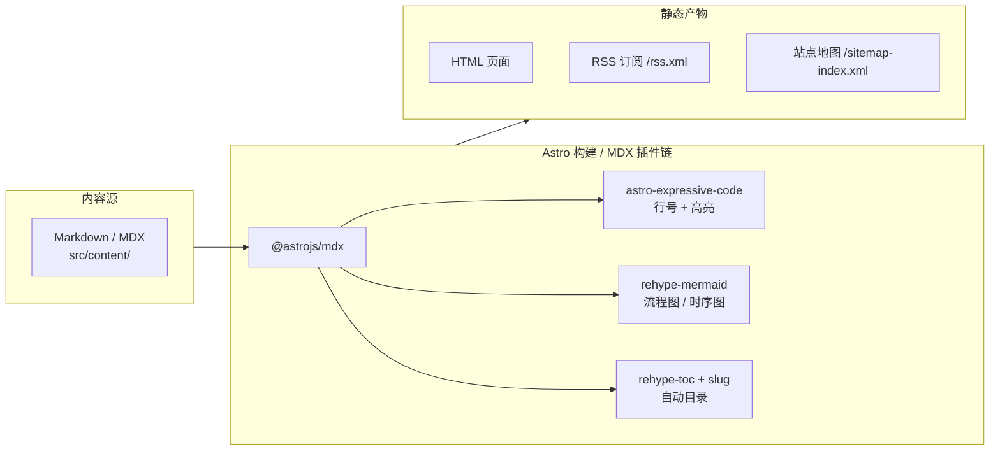

本博客（[portfolio.jianzhang.cc](https://portfolio.jianzhang.cc)）基于 **Astro** 框架搭建，底层使用 **TailwindCSS + DaisyUI** 实现响应式 UI，配合完整的 **rehype** 插件矩阵提供代码高亮、Mermaid 图表渲染、自动 TOC 等写作增强能力。

## 架构流程



## 核心特性

- **响应式阅读**：DaisyUI drawer 侧边栏 + 自适应排版，桌面 / 移动端一致体验
- **代码展示**：Expressive Code 高亮，支持 diff 语法、行号、标题栏
- **图文并茂**：rehype-mermaid 嵌入流程图、UML 时序图、饼图等
- **TOC 导航**：文章 h1-h3 自动生成目录，rehype-slug 锚点快速跳转
- **RSS / Sitemap**：自动生成 `/rss.xml` 与 `/sitemap-index.xml`
- **一键部署**：Netlify CI —— git push 即发布

## 内容生态

| 分类 | 文章数 | 说明 |
|---|---|---|
| LLM / AI | 20+ | RAG 实战、提示词工程、模型评估 |
| 技术教程 | 10+ | Next.js SSR、Astro 插件开发 |
| 项目复盘 | 5+ | Java 升级、急救物资系统、开发工具链 |
| 随笔 / 分享 | 若干 | 行业观察、读书笔记 |

## 写作工作流

通过 `pnpm md2docx <file>` 一键将 MDX 转换为 DOCX，方便导出存档或提交审阅。脚本位于 `scripts/md2docx.mjs`。

```bash
# 将一篇 MDX 文章导出为 Word 文档
pnpm md2docx src/content/blog/example.mdx
```

## 后续规划

- 集成评论系统（Giscus / Twikoo），支持读者互动
- 接入访问统计（Umami / Plausible），了解内容偏好
- 增加全站搜索（Pagefind），提升信息检索效率
