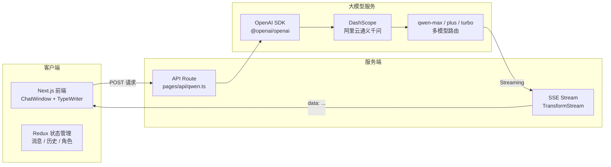

[Qwen Chatbot](https://qwen-chatbot.jianzhang.cc) 是一个基于 **Next.js** 全栈架构的 AI 对话应用，通过兼容 **OpenAI SDK** 的方式接入阿里云 **DashScope** 平台上的通义千问（Qwen）大模型，实现了与 OpenAI 产品一致的使用体验。项目集成了流式输出、多模型路由、可配置角色预设与 LLM 参数调优面板等功能，同时提供实时 Token 用量监控，帮助开发者直观理解和控制 API 调用成本。

## 架构流程

## 核心特性

- **SSE 流式输出**：基于 `TransformStream` + `TextEncoder` 实现服务端流式推送，客户端通过 `ReadableStream.getReader()` 逐块读取并实时渲染，配合 `TypeWriterEffect` 打字机组件呈现逐字动画效果
- **多模型路由**：支持 `qwen-turbo`（高效低成本）、`qwen-plus`（均衡）、`qwen-max`（最强推理）三档模型，用户可在对话界面动态切换
- **多角色预设**：内置客服助手、编程导师、文案写手三种 AI 角色，每种角色拥有独立的 System Prompt 定义行为规范与能力边界
- **参数调优面板**：提供 `temperature`、`top_p`、`max_tokens` 三项核心参数的实时调节控件，支持参数模式预设一键切换
- **Token 实时监控**：启用 `stream_options: { include_usage: true }` 获取精确的 `prompt_tokens`、`completion_tokens`、`total_tokens` 数据，在每条消息下方实时展示
- **对话历史管理**：自动保存多轮对话记录，采用滑动窗口策略控制上下文长度，避免超出模型最大 token 限制

## 参数模式配置

| 模式 | temperature | top_p | max_tokens | 适用场景 |
|------|------------|-------|------------|----------|
| 对话模式（默认） | 0.7 | 0.9 | 2048 | 日常问答、通用对话 |
| 创意模式 | 1.0 | 0.95 | 4096 | 文案写作、头脑风暴 |
| 精确模式 | 0.3 | 0.5 | 1024 | 代码生成、事实查询 |

## 技术栈

- **框架**：Next.js（Pages Router，全栈架构）
- **SDK**：OpenAI SDK（兼容模式，`baseURL` 指向 DashScope 端点）
- **模型**：通义千问 Qwen（turbo / plus / max）
- **状态管理**：Redux 消息队列 + 本地存储持久化
- **部署**：Vercel 一键部署
